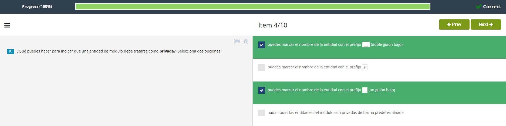

# **Soluciones Test Modulo 1**  

1. Un namespace es:
  
<br></br>

2. Si deseas importar ```pi``` de ```math```, que línea se utiliza?  
  
<br></br>

3. Cuál de los siguientes es **verdadero**?  
  
<br></br>

4. Qué puedes hacer para indicar que una entidad de módulo debe tratarse como **privada**? (selecciona **dos** opciones)  
  
<br></br>

5. Un **repositorio administrado por PWG**, que recopila código abierto de Python, lleva por nombre:  
  
<br></br>

6. A **PyPI** se le refiere a menudo como:  
  
<br></br>

7. El nombre *pip* proviene de:  
  
<br></br>

8. Qué es **verdadero** acerca de ```pip```? (selecciona **dos** respuestas):  
  
<br></br>

9. Cuando se usa ```pip``` para instalar un paquete que requiera una o más dependencias, entonces:  
  
<br></br>

10. Cuál de los siguientes comandos se utiliza para determinar la versión de ```pip```?  
  

<br></br>  

- [Volver al Test](TestM1.md)
#  
[Volver a: Módulo 1 - Módulos, paquetes y PIP](../README.md)