# **Soluciones Examen Modulo 1**  

1. El comando ```pip list``` presenta una lista de:  
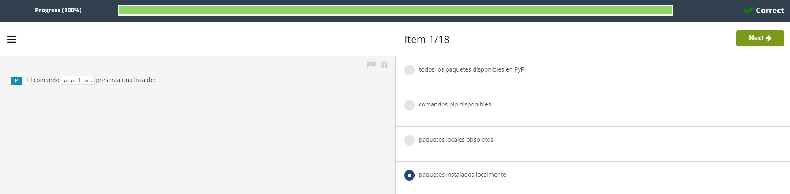  
<br></br>

2. Sabiendo que una función llamada ```fun``` reside dentro de un módulo llamado ```mod```, y se ha importado usando la siguiente linea:  
```
import mod
```
Selecciona la fiorma en que se puede invocar desde tu código.  
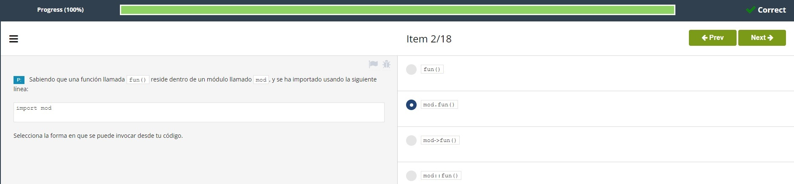  
<br></br>

3. Durante la primera importación de un módulo, Python despliega los archivos *pyc* en el directorio llamado:  
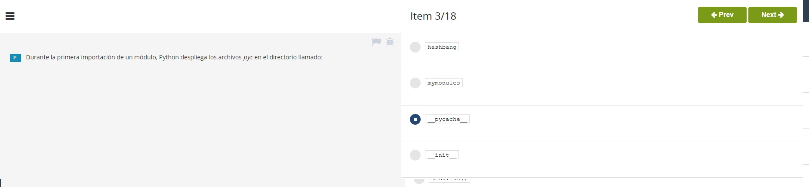  
<br></br>

4. Sabiendo que una función llamda ```fun()``` reside dentro de un módulo llamado ```mod```, selecciona la forma correcta de  
importarlo.  
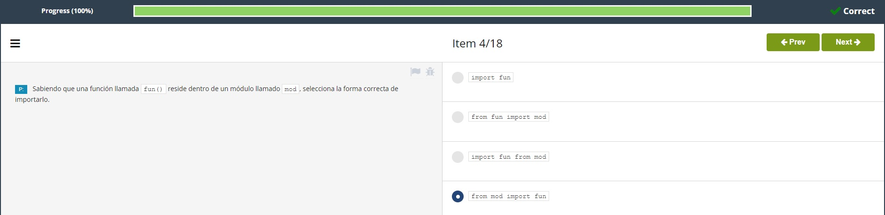  
<br></br>

5. Selecciona las sentencias **verdaderas**. (selecciona **dos** respuestas).  
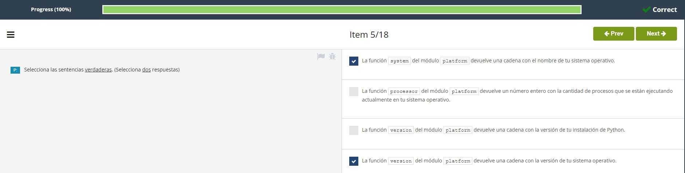  
<br></br>

6. La sigiente línea de código:  
```from a.b import c```  
causa la importación de:  
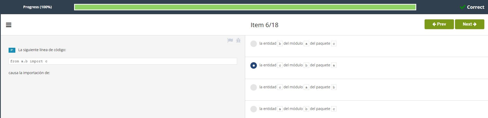  
<br></br>

7. Una variable predefinida de Python que almacena el nombre del módulo actual lleva por nombre:  
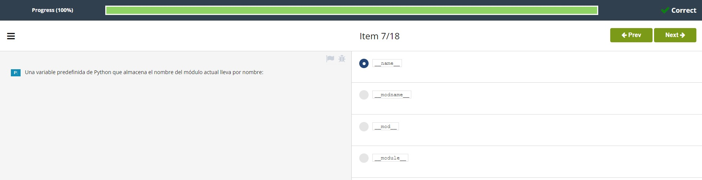  
<br></br>

8. Cuál es el resultado esperado del siguiente código?  
```
from random import randint  

for i in range(2):  
    print(randint(1, 2), end='')
```
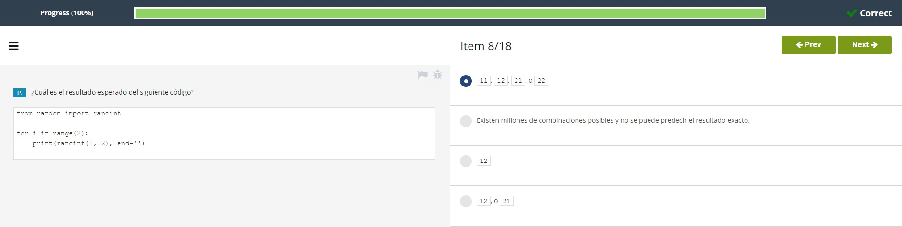  
<br></br>

9. Cuáles de las siguientes sentencias son **verdaderas** acerca del comando ```pip install```? (Selecciona **dos** respuestas) 

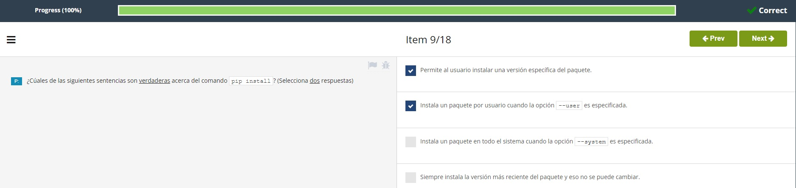  
<br></br>

10.  Una función que devuelve una lista de todas las entidades disponibles en un módulo lleva por nombre:  
  
<br></br>

11.  Cuál es el valor esperado asignado a la variable ```result``` después de que se ejecute el siguiente código?  
```
import math  

result = math.e != math.pow(2, 4)  
print(int(result))
```  
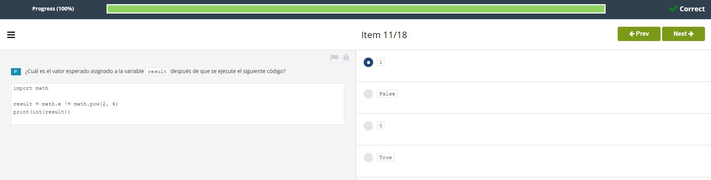  
<br></br>

12. Cuando se importa un módulo, su contenido:  
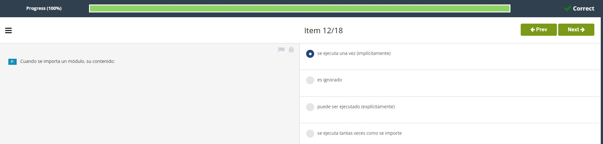  
<br></br>

13. Un archivo *pyc* contiene:  
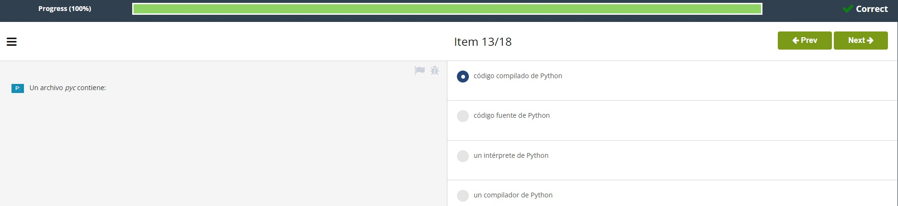  
<br></br>

14. Se puede obtener una lista de las dependencias de los paquetes en ```pip``` empleando el comando:  
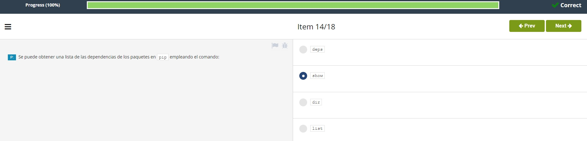  
<br></br>

15. Qué comando de ```pip``` se puede emplear para eliminar un paquete instalado?  
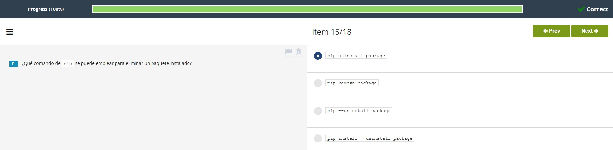  
<br></br>

16. Cuál de las siguientes sentencias es **verdadera** acerca de la actualización de paquetes de Python ya instalados?  
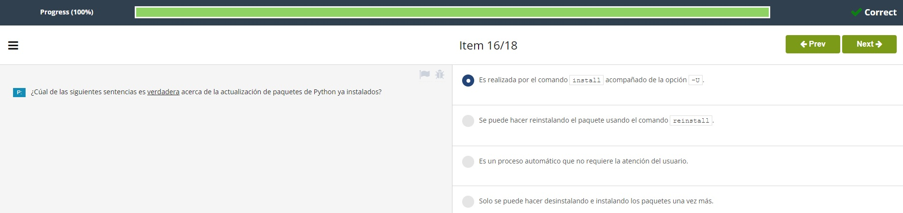  
<br></br>

17. El conjunto de caracteres escrito como ```#!``` se emplea para:  
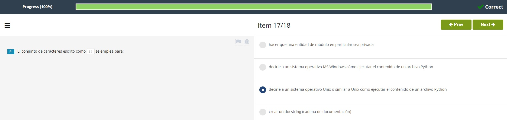  
<br></br>

18. Cuáles de las siguientes sentencias son **verdaderas** acerca del comando ```pipsearch```? (selecciona **dos** respuestas).  
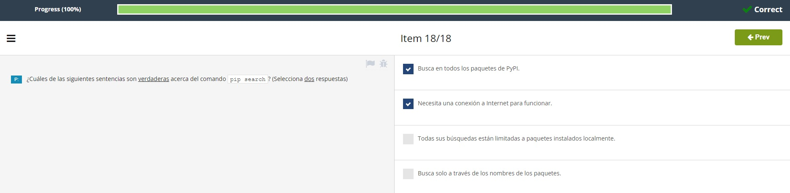  

<br></br>  
- [Volver al Examen](ExamenM1.md)
#
[Volver a: Módulo 1 - Módulos, paquetes y PIP](../README.md)