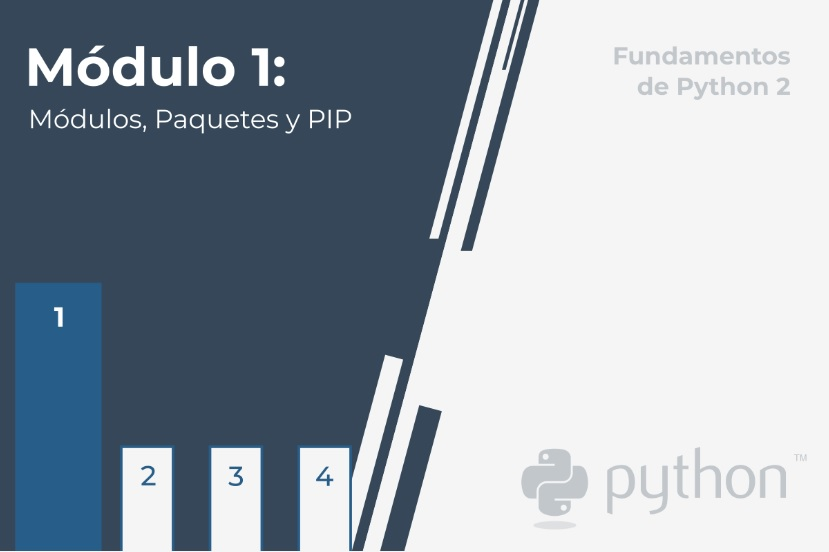

# **Fundamentos de Python 2: Módulo 1**  

  
    

## Módulo 1
**Módulos, Paquetes y Pip**

En este módulo, aprenderás como:  

- Importar y usar módulos de Python.
- Emplear algunos de los módulos más útiles de la biblioteca estándar de Python.
- Construir y usar paquetes de Python.
- PIP (Instalador de Paquetes de Python) y cómo usarlo para instalar y desinstalar  
paquetes listos para usar de PyPI.  

  

#   

1. [Seccion 1 - Módulos, Empleo e Importación](./Seccion1/_Seccion1.md)  
    - [Ejercicios](Seccion1/Sec1-ej.md)
  

2. [Seccion 2 - Módulos Útiles; math, Random, platform](./Seccion2/_Seccion2.md)
    - [Ejercicios](Seccion2/Sec2-ej.md)
  

3. [Seccion 3 - Módulos y Paquetes](./Seccion3/_Seccion3.md)
    - [Ejercicios](Seccion3/Sec3-ej.md)
  

4. [Seccion 4 - Instalador de Paquetes de Python (PIP)](./Seccion4/_Seccion4.md)  
    - [Ejercicios](Seccion4/Sec4-ej.md)
  

#   

- [Test de ensayo](EjerciciosTestModulo1/TestM1.md)  
- [Test de ensayo (soluciones)](EjerciciosTestModulo1/soltest_mod1.MD)

   

- [Examen Módulo 1](ExamenModulo1/ExamenM1.md)
- [Examen Módulo 1 (soluciones)](ExamenModulo1/)

#  

    
- [PCAP2 Certified Associate in Python Programming: inicio](../README.md)