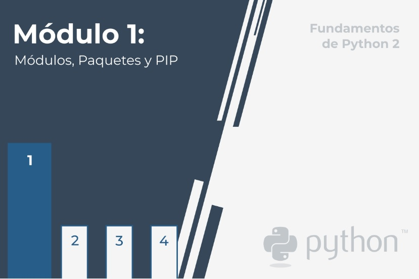
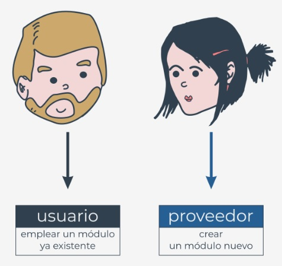
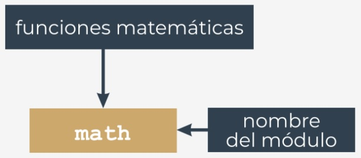
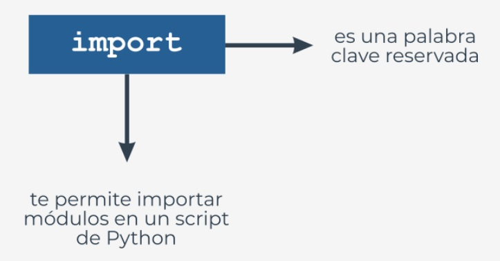
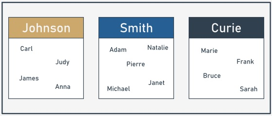
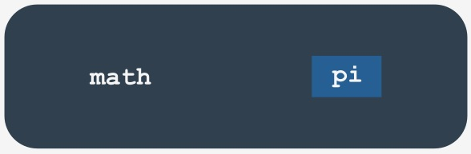

# Fundamentos de Python 2
## Módulo 1
**Módulos, Paquetes y Pip**

En este módulo, aprenderás como:  

- Importar y usar módulos de Python.
- Emplear algunos de los módulos más útiles de la biblioteca estándar de Python.
- Construir y usar paquetes de Python.
- PIP (Instalador de Paquetes de Python) y cómo usarlo para instalar y desinstalar  
paquetes listos para usar de PyPI.  


  
  
## Qué es un módulo?
  
El código de computadora tiene una tendencia a crecer. Podemos decir que el código que no crece probablemente sea completamente  
inutilizable o esté abandonado. Un código real, deseado y ampliamente utilizado se desarrolla continuamente, ya que tanto las  
demandas de los usuarios como sus expectativas se desarrollan de manera diferente.  
  
Un código que no puede responder a las necesidades de los usuarios se olvidará rápidamente y se reemplazará instantáneamente con  
un código nuevo, mejor y más flexible. Se debe esta preparado para esto, y nunca pienses que tus programas están terminados por  
completo. La finalización es un estado de transición y generalmente pasa rápidamente, después del primer informe de error. Python  
en sí es un buen ejemplo de cómo actúa esta regla.  

El código creciente es, de hecho, un problema creciente. Un código más grande siempre significa un mantenimiento más difícil. La  
búsqueda de errores siempre es más fácil cuando el código es más pequeño (al igual que encontrar una rotura mecánica es más  
simple cuando la maquinaria es más simple y pequeña).  

Además, cuando se espera que el código que se está creando sea realmente grande (puedes usar el número total de líneas de código  
como una medida útil, pero no muy precisa, del tamaño del código) entonces, se deseará, o más bien, habrá la necesidad de dividirlo  
en muchas partes, implementando en paralelo por unos cuantos, una docena, varias docenas o incluso varios cientos de  
desarrolladores.  

Por supuesto, esto no se puede hacer usando un archivo fuente grande, el cual esta siendo editado por todos los programadores al  
mismo tiempo. Esto seguramente conducirá a un desastre.  

Si se desea que dicho proyecto de software se complete con éxito, se deben tener los medios que permitan:  
  
- Dividir todas las tareas entre los desarrolladores.
- Después, unir todas las partes creadas en un todo funcional.  
  
Por ejemplo, un determinado proyecto se puede dividir en dos partes principales:  
  
- La interfaz de usuario (la parte que se comunica con el usuario mediante widgets y una pantalla gráfica).  
- La lógica (la parte que procesa los datos y produce resultados).  
  
Cada una de estas partes se puede (muy probablemente) dividir en otras más pequeñas, y así sucesivamente. Tal proceso a menudo  
se tenomina **descomposición**.  
  
Por ejemplo, si te pidieran organizar una boda, no harías todo tu mismo: encontrarías una serie de profesionales y dividirías la tarea  
entre todos.  
  
Cómo se divide una pieza de software en partes separadas pero cooperantes? Esta es la pregunta. Los **módulos** son la respuesta.  
  
  

## Cómo hacer uso de un módulo?  
  
Entonces, qué es un módulo? El tutorial de Python lo define como **un archivo que contiene definiciones y entencias de Python**,  
que se pueden importar más tarde y utilizar cuando sea necesario.  
  
El manejo de los módulos consta de dos cuestiones diferentes:  


  
- El primero (probablemente el más común) ocurre cuando se desea utilizar un módulo ya existente, escrito por otra persona o creado por  
el programador mismo en algún proyecto complejo: en este caso, se considera al programador como el **usuario** del módulo.
- El segundo ocurre cuando se desea crear un nuevo módulo, ya sea para uso propio o para facilitar la vida  
de otros programadores: aquí tu eres el **proovedor** del módulo.  

Discutamos ambos por separado.  
  
En primer lugar, un módulo se identifica por su **nombre**. si se desea utilizar cualquier módulo, se necesita saber su nombre. Se entrega  
una cantidad (bastante grande) de módulos junto con Python. Se puede pensar en ellos como una especie de "equipamiento adicional de Python".  
  
Todos estos módulos, junto con las funciones integradas, forman la **Biblioteca Estándar de Python** - un tipo especial de biblioteca  
donde los módulos desempeñan el papel de libros (incluso podemos decir que las carpetas desempeñan el papel de estanterías). Si  
deseas ver la lista completa de todos los "volúmenes" recopilados en esa biblioteca, se puede encontrar aquí:  
https://docs.python.org/3/library/index.html

Cada módulo consta de entidades (como un libro consta de capítulos). Estas entidades pueden ser funciones, variables, constantes,  
clases y objetos. Si se sabe como acceder a un módulo en particular, se puede utilizar cualquiera de las entidades que almacena.  



Comencemos la discusión con uno de los módulos más utilizados, el que lleva por nombre ```math```. Su nombre habla por sí mismo: el  
módulo contiene una rica colección de entidades (no solo funciones) que permiten a un programador implementar efectivamente  
cálculos que exigen el uso de funciones matemáticas, como *sen()* p *log()*.  
  

## Importando un módulo  
  
Para que un módulo sea utilizable, hay que **importarlo** (piensa en ello como sacar un libro del estante). La importación de un módulo  
se realiza mediante una instrucción llamada ```import```. Nota: ```import``` es también una palabra clave reservada (con todas sus  
implicaciones).  


  
Supongamos que deseas utilizar dos entidades proporcionadas por el módulo ```math```:  
  
- Un símbolo (constante) que representa un valor preciso (tan preciso como sea posible usando aritmética de punto flotante  
doble) de PI (aunque usar una letra griega para nombrar una variable es totalmente posible en Python, el símbolo se llama **pi**: es  
una solución más conveniente, especialmente para esa parte del mundo que ni tiene ni va a usar un Teclado Griego).
- Una función llamada ```sin()``` (el equivaente informático de la función matemática seno).  

Ambas entidades están disponibles a través del módulo ```math```, pero la forma en que se pueden usar depende en gran medida de  
como se haya realizado la importación.  
  
La forma más sencilla de importar un módulo en particular es usar la instrucción para importar de la siguiente manera:  
```
import math
```  
  
La cláusula contiene:  
- La palabra reservada ```import```.
- El **nombre del módulo** que se va a importar.

La instrucción puede colocarse en cualquier parte del código, pero debe colocarse **antes del primer uso de cualquiera de las**  
**entidades del módulo**.  
  
  
Si se desea (o se tiene que) importar más de un módulo, se puede hacer repitiendo la cláusula ```import```, como aquí:
```
import math
import sys
```
  
o enumerando los módulos después de la palabra clave reservada ```import```, como aquí:
```
import math, sys
```
  
La instrucción importa dos módulos, primero uno llamado ```math``` y luego un segundo llamado ```sys```.  
  
La lista de módulos puede ser arbitrariamente larga.  
  
## Importando un módulo: continuación  
  
Para continuar, debes familiarizarte con un término importante: **namespace**. No te preocupes, no entraremos en detalles: esta  
explicación será lo más breve posible.  
  
Un **namespace** es un espacio (entendido en un contexto no físico) en el que existen algunos nombres y los nombres no entran en  
conflicto entre sí (es decir, no hay dos objetos diferentes con el mismo nombre). Podemos decir que cada grupo social es un  
namespace - el grupo tiende a nombrar a cada uno de sus miembros de una manera única (por ejemplo, los padres no darían a sus  
hijos el mismo nombre).  
  
  
  
Esta singularidad se puede lograr de muchas maneras, por ejemplo, mediante el uso de apodos junto con los nombres(funcionará  
dentro de un grupo pequeño como una clase en una escuela) o asignando identificadores especiales a todos los miembros del grupo  
(el número de Seguro Social de EE.UU. es un buen ejemplo de tal práctica).  
  
**Dentro de un determinado namespace, cada nombre debe permanecer único**. Esto puede significar que algunos nombres pueden  
desaparecer cuando cualquier otra entidad de un nombre ya conocido ingresa al namespace. Mostraremos como funciona y como  
controlarlo, pero primero, volvamos a las importaciones.  
  
Si el m+odulo de un nombre especificado **existe y es accesible** (un módulo es de hecho un **archivo fuente de Python**), Python  
importa su contenido, **se hacen conocidos todos los nombres definidos en el módulo**, pero no ingresan al namespace del código.  
  
Esto significa que puedes tener tus propias entidades llamadas ```sin``` o ```pi``` y no serán afectadas en alguna manera  
por la importación.  
  
  
  
En este punto, es posible que te estes preguntando como acceder al ```pi``` el cual viene con el módulo ```math```.  
  
Para hacer esto, se debe mandar llamar el ```pi``` con el nombre del módulo original.  
  
## Importando un módulo:  continuación
  
Observa el fragmento a continuación, esta es la forma en que se habilitan los nombres de ```pi``` y ```sin``` con el  
nombre de su módulo de origen:  
  
```
math.pi
math.sin
```  
  
Es sencillo, se pone:  
  
- El **nombre del módulo**(```math```).
- Un **punto**.
- El **nombre de la entidad**(```pi```).

Tal forma indica claramente el namespace en el que existe el nombre.  
  
Nota: el uso de esto es **obligatorio** si un módulo ha sido importado con la instrucción ```import```. No importa si  
alguno de los nombres del código y del namespace del módulo están en conflicto o no.  
  
  
Este primer ejemplo no será muy avanzado: solo se desea imprimir el valor de **sin(½π)**.  
  
Observa el código en el editor. Así es como se prueba.  
```
import math
print(math.sin(math.pi/2))
```
El código genera el valor esperado: ```1.0```.  
  
Nota: el eliminar cualquiera de las dos indicaciones del nombre del módulo hará que el código sea erróneo. No  
hay otra forma de entrar al namespace de ```math``` si se hizo lo siguiente:  
```
import math

```  
  
