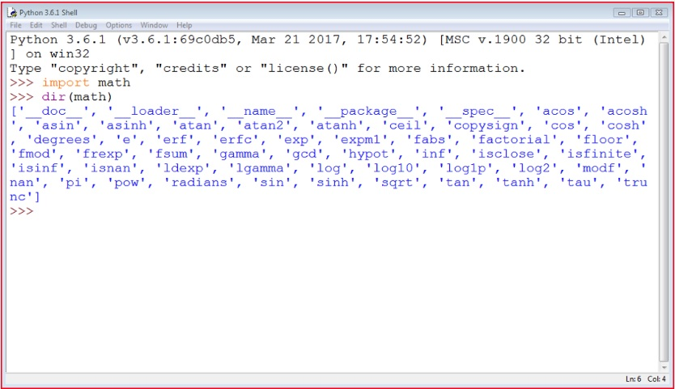

## **Trabajando con módulos estándar**  
  
Antes de comenzar a revisar algunos módulos estándar de Python, veamos la función ```dir()```. No tiene nada que ver con el comando  
```dir()``` de las terminales de Windows o Unix. El comando ```dir()``` no muestra el contenido de un directorio o carpeta de disco, pero no  
se puede negar que hace algo similar: puede revelar todos los nombres proporcionados a través de un módulo en particular.  
  
Existe una condición: el módulo debe haberse importado previamente como un todo (es decir, utilizar la instrucción ```import```  
```module``` - ```from module``` no es suficiente).  
  
La función devuelve una **lista ordenada alfabéticamente** la cual contiene todos los nombres de las entidades disponibles en el  
módulo:  
```
dir(module)
```  
  
Nota: Si el nombre del módulo tiene un alias, debes usar el alias, no el nombre original.  
  
Usar la función dentro de un script normal no tiene mucho sentido, pero aún así, es posible.  
  
Por ejemplo, se puede ejecutar el siguiente código para imprimir los nombres de todas las entidades dentro del módulo ```math```:  
```
import math  
  
for name in dir(math):  
    print(name, end="\t")
```  
  
El código de ejemplo debería producir el siguiente resultado:  
```
__doc__ __loader__  __name__    __package__ __spec__    acos    acosh   asin  
asinh   atan    atan2   atanh   ceil    copysign    cos cosh    degrees e   erf  
erfc    exp expm1   fabs    factorial   floor   fmod    frexp   fsum    gamma   hypot  
isfinite    isinf   isnan   ldexp   lgamma  log log10   log1p   log2    modf    pi  
pow radians sin sinh    sqrt    tan tanh    trunc
```  
  
Has notado los nombres extraños que comienzan con ```__``` al inicio de la lista? Se hablará de ellos cuando hablemos sobre los  
problemas relaccionados con la escritura de módulos propios.  
  
Algunos de los nombres pueden traer recuerdos de las lecciones de matemáticas, y probablemente no tendrás ningún problema en  
adivinar su significado.  
  
El emplear la función ```dir()``` dentro de un código puede no parecer muy útil; por lo general, se desea conocer el contenido de un  
módulo en particular antes de escribir y ejecutar el código.  
  
Afortunadamente, se puede ejecutar la función **directamente en la consola de Python** (IDLE), sin necesidad de escribir y ejecutar un  
script por separado.  
  
Así es como se puede hacer:  
```
import math
dir(math)
```  
  
Deberías ver algo similar a esto:  
  
  
  
## **Funciones seleccionadas del módulo *math***  
  
Comencemos con una vista previa de algunas de las funciones proporcionadas por el módulo ```math```.  
  
Se han elegido algunas arbitrariamente, pero esto no significa que las funciones no mencionadas aquí sean  
menos signficativas. Tómate el tiempo para revisar las demás por ti mismo: no tenemos el espacio ni el tiempo  
para hablar de todas a detalle.  
  
El primer grupo de funciones de módulo ```math``` están relaccionadas con **trigonometría**:  
  
- ```sin(x)``` -> es el seno de x.
- ```cos(x)``` -> es el coseno de x.
- ```tan(x)``` -> es la tangente de x.  
  
Todas estas funciones toman un argumento (una medida de ángulo expresada en radianes) y devuelven el  
resultado apropiado (ten cuidado con ```tan()``` - no todos los argumentos son aceptados).  
  
Por supuesto, también están sus versiones inversas:  
  
- ```asin(x)``` -> es el arcoseno de x.
- ```acos(x)``` -> es el arcocoseno de x.
- ```atan(x)``` -> es el arcotangente de x.  
  
Estas funciones toman un argumento (verifican que sea correcto) y devuelven una medida de un ángulo en  
radianes.  
  
  
Para trabajar eficazmente con mediciones de ángulos, el módulo ```math``` proporciona las siguientes entidades:  
  
- ```pi``` -> una constante con un valor que es una aproximación de π.
- ```radians(x)``` -> una función que convierte el x de grados a radianes.
- ```degrees(x)``` -> una función que convierte x de radianes a grados.  
  
  
Ahora observa el código en el editor. El programa de ejemplo no es muy sofisticado, pero puedes predecir sus  
resultados?  
  
```
from math import pi, radians, degrees, sin, cos, tan, asin

ad = 90
ar = radians(ad)
ad = degrees(ar)

print(ad == 90.)
print(ar == pi / 2.)
print(sin(ar) / cos(ar) == tan(ar))
print(asin(sin(ar)) == ar)
```
  
Además de las funciones circulares (enumeradas anteriormente), en el módulo ```math``` también contiene un  
conjunto de sus **análogos hiberbólicos**:  
  
- ```sinh(x)``` -> el seno hiperbólico.
- ```cosh(x)``` -> el coseno hiperbólico.
- ```tanh(x)``` -> el tangente hiperbólico.
- ```asinh(x)``` -> el arcoseno hiperbólico.
- ```acosh(x)``` -> el arcocoseno hiperbólico.
- ```atanh(x)``` -> el arcotangente hiperbólico.  
  
  
## **Funciones seleccionadas del módulo *math*: continuación**  
  
Existe otro grupo de las funciones ```math``` relaccionadas con la **exponenciación**:  
  
- ```e``` -> una constante con un valor que es una aproximación del número de Euler (e).
- ```exp(x)``` -> encontrar el valor de e<sup>x</sup>.
- ```log(x)``` -> el logaritmo natural de x.
- ```log(x , b)``` -> el logaritmo de x con base b.
- ```log10(x)``` -> el logaritmo decimal de x (más preciso que ```log(x , 10)```).
- ```log2(x)``` -> el logaritmo binario de x (más preciso que ```log(x , 2)```).  
  
  
Nota: la función ```pow()```:  
  
- ```pow(x , y)``` -> encuentra el valor de x<sup>y</sup> (toma en cuenta los dominios).  
  
Esta es una función incorporada y no se tiene que importar.  
  
Observa el código el editor. Puedes predecir su salida?  
```
from math import e, exp, log

print(pow(e, 1) == exp(log(e)))
print(pow(2, 2) == exp(2 * log(2)))
print(log(e, e) == exp(0))
```  
  
  
## **Funciones seleccionadas del módulo *math*: continuación**  
  
El último grupo consta de algunas funciones de propósito general como:  
  
- ```ceil(x)``` -> devuelve el entero más pequeño mayor o igual que x.
- ```floor(x)``` -> el entero más grande menor o igual que x.
- ```trunc(x)``` -> el valor de x truncado a un entero (ten cuidado, no es equivalente a ceil o floor).
- ```factorial(x)``` -> devuelve x! (x tiene que ser un valor entero y no negativo).
- ```hypot(x, y)``` -> devuelve la longitud de la hipotenusa de un triángulo rectángulo con las longitudes de  
los catetos iguales a (x) y (y) (lo mismo que ```sqrt(pow(x , 2) + pow(y , 2))``` pero más preciso).  
  
Observa el código en el editor. Analiza el programa cuidadosamente.
```
from math import ceil, floor, trunc  

x = 1.4
y = 2.6  

print(floor(x), floor(y))
print(floor(-x), floor(-y))
print(ceil(x), ceil(y))
print(ceil(-x), ceil(-y))
print(trunc(x), trunc(y))
print(trunc(-x), trunc(-y))
```  
  
Demuestra las diferencias fundamentales entre ```ceil()```, ```floor()``` y ```trunc()```.  
  
Ejecuta el programa y verifica su salida.  
  
  
## Existe aleatoriedad real en las computadoras?  
  
Otro módulo que vale la pena mencionar es el que se llama ```random```.  
  
Ofrece algunos mecanismos que permiten operar con **números pseudoaleatorios**.  
  
Toma en cuenta el prefijo **pseudo** - los números generados por los módulos pueden parecer  
aleatorios en el sentido de que no se pueden predecir, pero no hay que olvidar que todos se  
calculan utilizando algoritmos muy refinados.  
  
Los algoritmos no son aleatorios, son deterministas y predecibles. Sólo aquellos procesos físicos que se  
salgan completamente de nuestro control (como la intensidad de la radiación cósmica) pueden usarse  
como fuente de datos aleatorios reales. Los datos producidos por computadoras deterministas no pueden  
ser aleatorios de ninguna manera.  
  
Un generador de n]umeros aleatorios toma un valor llamado **semilla**, lo trata como un valor de entrada, calcula un número "aleatorio"  
basado en él (el método depende de un algoritmo elegido) y produce una **nueva semilla**.  
  
La duración de un ciclo en el que todos los valores semilla son únicos puede ser muy largo, pero no es infinito: tarde o temprano los  
valores iniciales comenzarán a repetirse y los valores generadores también se repetirán. Esto es normal. Es una característica, no un  
error.  
  
El valor de la semilla inicial, establecido durante el inicio del programa, determina el orden en que aparecerán los valores generados.  
  
El factor aleatorio del proceso puede ser **aumentado al establecer la semilla tomando un número de la hora actual** - esto puede  
garantizar que cada ejecución del programa comience desde un valor semilla diferente (por lo tanto, usará diferentes números  
aleatorios).  
  
Afortunadamente, Python realiza dicha inicialización al importar el módulo.  
  
  
## Funciones seleccionadas del módulo *random*  
  
# **La función** *random*  
  
La función general llamada ```random()``` (no debe confundirse con el nombre del módulo) **produce un número**  
**flotante** ```x``` **entre el rango** ```(0.0 , 1.0)``` - en otras palabras: (0.0 <= x < 1.0).  
  
El programa de ejemplo a continuación producirá cinco valores pseudoaleatorios, ya que sus valores están  
determinados por el valor semilla actual (bastante impredecible), no puedes adivinarlos:  
```
from random import random  
  
for i in range(5):
    print(random())
```  
  
Ejecuta el programa. Esto es lo que tenemos:  
```
0.9535768927411208
0.5312710096244534
0.8737691983477731
0.5896799172452125
0.02116716297022092
```  
  
# **La función** *seed*  
  
La funcion ```seed()``` es capaz de directamente **establecer la semilla del generador**. Te mostramos dos de sus  
variantes:  
  
- ```seed()``` - establece la semilla con la hora actual.
- ```seed(int_value)``` - establece la semilla con el valor entero ```int_value```.  
  
Hemos modificado el programa anterior; de hecho, hemos eliminado cualquier rastro de aleatoriedad del  
código:  
```
from random import random, seed  
  
seed(0)  
  
for i in range(5):
    print(random())
```  
  
Debido al hecho de que la semilla siempre se establece con el mismo valor, la secuencia de valores generados  
siempre se ve igual.  
  
Ejecuta el programa. Esto es lo que tenemos:  
```
0.8444218515250481
0.7579544029403025
0.420571580830845
0.25891675029296335
0.5112747213686085
```  

Y tú?  
  
Nota: tus valores pueden ser ligeramente diferentes si tu sistema utiliza aritmética de punto flotante más  
precisa o menos precisa, pero la diferencia se verá bastante lejos del punto decimal.  
  
  
## **Fuentes seleccionadas del módulo** *random*: **continuación**  
  
# **Las funciones** *randrange* **y** *randint*  
  
Si deseas valores aleatorios enteros, una de las siguientes funciones encajaría mejor:  
  
- ```randrange(fin)```  
- ```randrange(inicio, fin)```
- ```randrange(inicio, fin, incremento)```
- ```randint(izquierda, derecha)```  
  
Las primeras tres invocaciones generarán un valor entero tomado (pseudoaleatoriamente) del rango:  
  
- ```range(fin)```
- ```range(inicio, fin)```
- ```range(inicio, fin, incremento)```
  
Toma en cuenta la **exclusión impícita del lado derecho**.  
  
La última función es equivalente a ```radrange(izquierda, derecha+1)``` - genera el valor entero ```i```, el cual  
cae en el rango [izquierda, derecha] (sin exclusión en el lado derecho).  
  
Observa el código en el editor. Este programa generará una línea que consta de tres ceros y un cero o un uno en  
el cuarto lugar.  
```
from random import randrange, randint

print(randrange(1), end=' ')
print(randrange(0, 1), end=' ')
print(randrange(0, 1, 1), end=' ')
print(randint(0, 1))
```
  
## **Fuentes seleccionadas del módulo** *random*: **continuación**
  
Las funciones anteriores tienen una desventaja importante: pueden producir valores repetidos incluso si el  
número de invocaciones posteriores no es mayor que el rango especificado.  
  
Observa el código en el editor. Es muy probable que el programa genere un conjunto de números en el que  
algunos elementos no sean únicos.  
```
from random import randint  
  
for i in range(10):  
    print(randint(1, 10), end=',')
```  
  
Esto es lo que se obtuvo al ejecutarlo:
```9,4,5,4,5,8,9,4,8,4,```  
  
# **Las funciones** *choice* **y** *sample*  
  
Como puedes ver, esta no es una buena herramienta para generar números para la lotería. Afortunadamente,  
existe una mejor solución que escribir tu propio código para verificar la singularidad de los números  
"sorteados".  
  
Es una función con el nombre de ```choice```:  
  
- ```choice(secuencia)```
- ```sample(secuencia, elementos_a_elegir=1)```  
  
La primera variante elige un elemento "aleatorio" de la secuencia de entrada y lo devuelve.  
  
El segundo crea una lista (una muestra) que consta del elemento ```elementos_a_elegir``` (que por defecto es  
```1```) "sorteado" de la secuencia de entrada.  
  
En otras palabras, la función elige algunos de los elementos de entrada, devolviendo una lista con la elección.  
Los elementos de la muestra se colocan en orden aleatorio. Nota que ```elementos_a_elegir``` no debe ser  
mayor que la longitud de la secuencia de entrada.  
  
Observa el código a continuación:
```
from random import choice, sample  
  
my_list = [1, 2, 3, 4, 5, 6, 7, 8, 9, 10]  
  
print(choice(my_list))
print(choice(my_list, 5))
print(choice(my_list, 10))
```  
  
Nuevamente, la salida del programa no es predecible. Nuestros resultados se ven así:  
```
4
[3, 1, 8, 9, 10]
[10, 8, 5, 1, 6, 4, 3, 9, 7, 2]
```  
  
  
## **Cómo saber dónde estas?**  
  
A veces, puede ser necesario encontrar información no relacionada con Python. Por ejemplo, es posible  
que necesites conocer la ubicación de tu programa dentro del entorno de la computadora.  
  
