## **Qué es un paquete?**  
  
Escribir tus propios módulos no difiere mucho de escribir scripts comunes.  
  
Existen algunos aspectos específicos que se deben tomar en cuenta, pero definitivamente no es algo complicado. Lo verás pronto.  
  
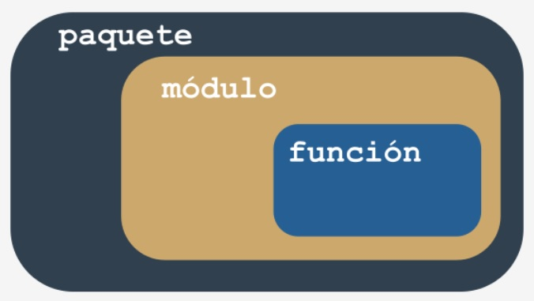  
  
Resumamos algunos aspectos importantes:  
  
- Un **módulo es un contenedor lleno de funciones** - Puedes empaquetar tantas funciones como desees en un módulo y  
distribuirlo por todo el mundo.  
- Por supuesto, no es buena idea mezclar funciones con diferentes áreas de aplicación dentro de un módulo (al igual que en  
una biblioteca: nadie espera que los trabajos científicos se incluyan entre los cómics), así que se deben agrupar las funciones  
cuidadosamente y asignar un nombre claro e intuitivo al módulo que las contiene (por ejemplo, no le des el nombre  
```videojuegos``` a un módulo que contiene funciones destinadas a particionar y formatear discos duros).  
- Crear muchos módulos puede causar desorden: tarde o temprano querrás **agrupar tus módulos** de la misma manera que  
previamente has agrupado funciones: Existe un contenedor más general que un módulo?  
- Sí lo hay, es un **paquete**: en el mundo de los módulos, un paquete juega un papel similar al de una carpeta o directorio en el  
mundo de los archivos.  
  
  
## **Tu primer módulo: paso 1**  
  
En esta sección, trabnajarás localmente en tu máquina. Comencemos desde cero. Crea un archivo vacío, de la siguiente manera:  
  
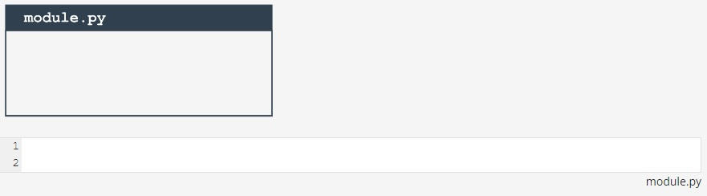  
  
Se necesitan dos archivos para realizar estos experimentos. Uno de ellos será el *módulo* en sí. Está vacío ahora. No te preocupes, lo  
vas a llenar con código pronto.  
  
El archivo lleva por nombre *module.py*. No muy creativo, pero es simple y claro.  
  
  
## **Tu primer módulo: paso 2**  
  
El segundo archivo contiene el código que utiliza el nuevo módulo. Su nombre es *main.py*. Su contenido es muy breve hasta ahora:  
  
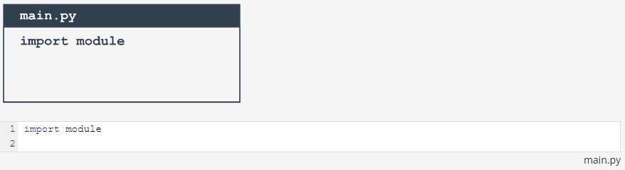  
  
Nota: **ambos archivos deben estar ubicados en la misma carpeta**. Te recomendamos crear una carpeta nueva y vacía para ambos  
archivos. Esto hará que las cosas sean más fáciles.  
  
Inicia el IDLE (o cualquier otro que prefieras) y ejecuta el archivo *main.py*. Qué es lo que ves?  
  
No deberías ver nada. Esto significa que Python a importado con éxito el contenido del archivo module.py.  
  
No importa que el módulo esté vacío por ahora. El primer paso ya está hecho, pero antes de dar el siguiente paso, queremos que  
eches un vistazo a la carpeta en la que se encuentran ambos archivos.  
  
Notas algo interesante?  
  
Ha aparecido una nueva subcarpeta, puedes verla? su nombre es __pycache__. Echa un vistazo adentro. Qué es lo que ves?  
  
Hay un archivo llamado (más o menos) *module.cpython-xy.pcy* donde *x* y *y* son dígitos derivados de tu versión de Python (por  
ejemplo, serán *3* y *8* si utilizas Python 3.8).  
  
El nombre del archivo es el mismoq ue el de tu módulo. La parte posterior al primer punto dice qué implementación de Python ha  
creado el archivo (*CPython*) y su número de versión. La ultima parte (pyc) viene de las palabras *Python* y *compilado*.  
  
Puedes mirar dentro del archivo: el contenido es completamente ilegible para los humanos. Tiene que ser así, ya que el archivo está  
destinado solo para el uso de Python.  
  
Cuando Python importa un módulo por primera vez, **traduce el contenido a una forma algo compilada**.  
  
El archivo no contiene código en lenguaje máquina: es **código semi-compilado** interno de Python, listo para ser ejecutado por el  
intérprete de Python. Como tal archivo no requiere tantas comprobaciones como las de un archivo fuente, la ejecución comienza más  
rápido y también se ejecuta más rápido.  
  
Gracias a eso, cada importación posterior será más rápida que interpretar el código fuente desde cero.  
  
Python puede verificar si el archivo fuente del módulo ha sido modificado (en este caso, el archivo *pyc* será reconstruido) o no  
(cuando el archivo *pyc* pueda ser ejecutado al instante). Este proceso es completamente automático y transparente, no tiene que ser  
tomado en cuenta.  
  
  
## **Tu primer módulo: paso 3**  
  
Ahora hemos puesto algo en el archivo del módulo:  
  
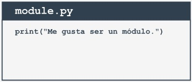  
  
Puedes notar alguna diferencia entre un módulo y un script ordinario? No hay ninguna hasta ahora.  
  
Es posible ejecutar este archivo como cualquier otro script. Pruébalo por ti mismo.  
  
Qué es lo que pasa? deberías ver la siguiente línea dentro de tu consola:  
  
```
Me gusta ser un módulo.
```  
  
## **Tu primer módulo: paso 4**  
  
Volvamos al archivo *main.py*  
Ejecuta el archivo. Qué ves? Con suerte veras algo como esto:  
```
Me gusta ser un módulo.
```  
  
Qué significa realmente?  
  
Cuando un módulo es importado, su contenido es **ejecutado impliícitamente por Python**. Le da al módulo la oportunidad de  
inicializar algunos de sus aspectos internos (por ejemplo, puede asignar a algunas variables valores útiles).  
  
Nota: la **inicialización se realiza sólo una vez**. Cuando se produce la primera importación, por lo que las asignaciones realizadas por  
el módulo no se repiten innecesariamente.  
  
Imagina el siguiente contexto:  
  
- Existe un módulo llamado *mod1*.
- Existe un módulo llamado *mod2* el cual contiene la instrucción ```import mod1```.  
- Hay un archivo principal que contiene las instrucciones ```import mod1``` e ```import mod2```.  
  
A primera vista, se puede pensar que *mod1* será importado dos veces - afortunadamente, **solo se produce la primera importación**.  
Python recuerda los módulos importados y omite silenciosamente todas las importaciones posteriores.  
  

## **Tu primer módulo: paso 5  
  
Python puede hacer mucho más que solo importar el módulo. También crea una variable llamada ```__name__```.  
  
Además, cada archivo fuente usa su propia versión separada de la variable, no se comparte entre módulos.  
  
Te mostraremos como usarlo. Modifica el módulo un poco:  
  
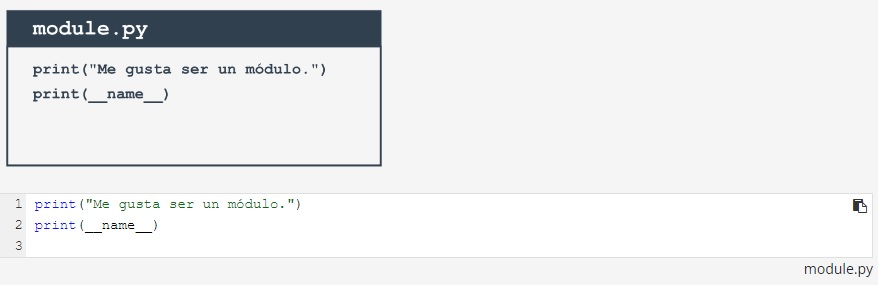  
  
Ahora ejecuta el archivo *module.py*. Deberías ver las siguientes líneas:  
```
Me gusta ser un módulo.
__main__
```  
  
Ahora ejecuta el archivo *main.py*. Ves lo mismo?
```
Me gusta ser un módulo.  
module
```  
  
Podemos decir que:  
  
- Cuando se ejecuta un archivo directamente, su variable ```__name__``` se establece a ```__main__```.  
- Cuando un archivo se importa como un módulo, su variable ```__name__``` se establece al nombre del archivo (excluyendo a *.py*).  
  
  
## **Tu primer módulo: paso 6  
  
Así es como puedes hacer uso de la variable ```__main__``` para detectar el contexto en el cual se activó tu código:  
  
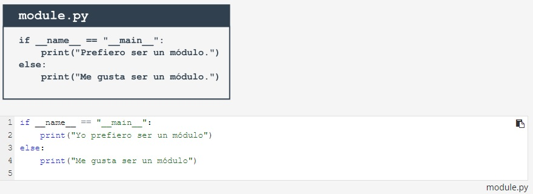  
  
Sin embargo, existe una forma más inteligente de utilizar la variable. Si escribes un módulo lleno de varias funciones complejas,  
puedes usarla para colocar una serie de pruebas para verificar si las funciones trabajan correctamente.  
  
Cada vez que modifiques alguna de estas funciones, simplemente puedes ejecutar el módulo para asegurarte de que sus enmiendas  
no estropeen el código. Estas pruebas se omitirán cuando el código se importe como un módulo.  
  
  
## **Tu primer módulo: paso 7  
  
Este módulo contendrá dos funciones simples, y si deseas saber cuantas veces se han invocado las funciones, necesitas un contador  
inicializado en cero cuando se importe el módulo.  
  
Puedes hacerlo de la siguiente manera:  
  
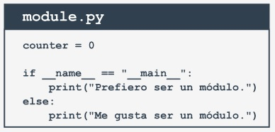  
  
```
counter = 0

if __name__ == "__main__":
    print("Yo prefiero ser un módulo")
else:
    print("Me gusta ser un módulo")
```  
  
  
## **Tu primer módulo: paso 8  
  
El introducir tal variable es absolutamente correcto, pero puede causar importantes **efectos secundarios** que debes tomar en  
cuenta.  
  
Analiza el archivo modificado *main.py*:  
  
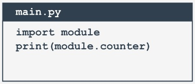  
```
import module  
print(module.counter)
```  
  
Como puedes ver, el archivo principal intenta acceder a la variable de contador del módulo. Es esto legal? Sí lo es. Es utilizable?  
Claro. Es seguro?  
  
Eso depende: si confias en los usuarios de tu módulo, no hay problema; sin embargo, es posible que no desees que el resto del  
mundo vea tu **variable personal o privada**.  
  
A diferencia de muchos otros lenguajes de programación, Python no tiene medios para permitirte ocultar tales variables a los ojos de  
los usuarios del módulo.  
  
Solo puedes informar a tus usuarios que esta es tu variable, que pueden leerla, pero que no deben modificarla bajo ninguna  
circunstancia.  
  
Esto se hace anteponiendo al nombre de la variable ```_``` (un guión bajo) o ```__``` (dos guiones bajos), pero recuerda, es solo un **acuerdo**.  
Los usuarios de tu módulo pueden obedecerlo o no.  
  
Nosotros por supuesto, lo respetaremos. Ahora pongamos dos funciones en el módulo: evaluarán la suma y el producto de los  
números recopilados en una lista.  
  
Además, agregaremos algunos adornos allí y eliminaremos los restos superfluos.  
  
  
## **Tu primer módulo: paso 9**  
  
Bueno. Escribamos un código nuevo en nuestro archivo *module.py*. El módulo actualizado esta listo aquí:  
```
#!/usr/bin/env python3 

""" module.py - Un ejemplo de un módulo en Python """

__counter = 0


def suml(the_list):
    global __counter
    __counter += 1
    the_sum = 0
    for element in the_list:
        the_sum += element
    return the_sum


def prodl(the_list):
    global __counter    
    __counter += 1
    prod = 1
    for element in the_list:
        prod *= element
    return prod


if __name__ == "__main__":
    print("Yo prefiero ser un módulo, pero puedo realizar algunas pruebas por ti")
    my_list = [i+1 for i in range(5)]
    print(suml(my_list) == 15)
    print(prodl(my_list) == 120)
```  
  
Algunos elementos necesitan explicación:  
  
- La linea que comienza con ```#!``` tiene muchos nombres - puede ser llamada shabang, shebang, hashbang, poundbang o incluso  
hashpling (no nos preguntes por qué). El nombre en sí no significa nada aquí, su papel es más importante. Desde el punto de  
vista de Python, es solo un **comentario** debido a que comienza con ```#```. Para sistemas operativos Unix y similares a Unix  
(incluido MacOS),  dicha linea **indica al sistema operativo como ejecutar el contenido del archivo** (en otras palabras, que  
programa debe ejecutarse para interpretar el texto). En algunos entornos (especialmente aquellos conectados con servidores  
web) la ausencia de esa línea causará problemas.  
- Una cadena (quizás una multilínea) colocada antes de las instrucciones de cualquier módulo (incluidas las importaciones) se  
denomina **doc-string** y debe explicar brevemente el propósito y el contenido del módulo.  
- Las funciones definidas dentro del módulo (```suml()``` y ```prodl()```) están disponibles para ser importadas.  
- Se ha utilizado la variable ```__name__``` para detectar cuando se ejecuta el archivo de forma independiente, y se aprovechó esta  
oportunidad para realizar algunas pruebas sencillas.  
  
  
## **Tu primer módulo: paso 10**  
  
Ahora es posible usar el nuevo módulo, esta es una forma de hacerlo:  
  
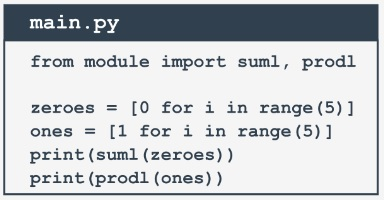
```
from module import suml, prodl

zeroes = [0 for i in range(5)]
ones = [1 for i in range(5)]
print(suml(zeroes))
print(prodl(ones))
```  
  
  
## **Tu primer módulo: paso 11**  
  
Es hora de hacer este ejemplo más complejo: hemos asumido aquí que el archivo Python principal se encuentra en la misma carpeta  
o directorio que el módulo que se va a importar.  
  
Renunciemos a esta suposición y realicemos el siguiente experimento mental:  
  
- Estamos utilizando el sistema operativo Windows ® (esta suposición es importante, ya que la forma del nombre del archivo  
depende de ello).  
- El script principal de Python se encuentra en *C:\Users\user\py\progs* y se llama *main.py*.  
- El módulo a importar se encuentra en *C:\Users\user\py\modules*.  
  
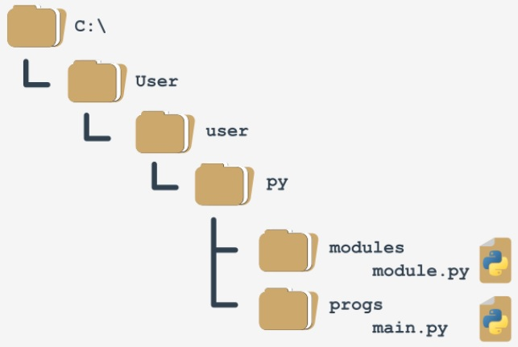  
  
Cómo lidiar con ello?  
  
Para responder a esta pregunta, tenemos que hablar sobre **omo Python busca los módulos**. Hay una variable especial (en realidad  
una lista) que almacena todas las ubicaciones (carpetas o directorios) que se buscan para encontrar un módulo que ha sido solicitado  
por la instrucción import.  
  
Python examina estas carpetas en el orden en que aparecen en la lista: si el módulo no se puede encontrar en ninguno de estos  
directorios, la importación falla.  
  
De lo contrario, se tomará en cuenta la primera carpeta que contenga un módulo con el nombre deseado (si alguna de las carpetas  
restantes contiene un módulo con ese nombre, se ignorará).  
  
La variable se llama ```path``` (ruta), y es accesible a través del módulo llamado ```sys```. Así es como puedes verificar su valor:  
```
import sys  
  
for p in sys.path:  
    print(p)
```  
  
Hemos ejecutado el código dentro del directorio *C:\User\user* y esto es lo que obtenemos:  
```
C:\Users\user
C:\Users\user\AppData\Local\Programs\Python\Python36-32\python36.zip
C:\Users\user\AppData\Local\Programs\Python\Python36-32\DLLs
C:\Users\user\AppData\Local\Programs\Python\Python36-32\lib
C:\Users\user\AppData\Local\Programs\Python\Python36-32
C:\Users\user\AppData\Local\Programs\Python\Python36-32\lib\site-packages
```  
  
Nota: la carpeta en la que comienza la ejecución aparece en el **primer elemento de la ruta**.  
  
Ten en cuenta también que: hay un archivo zip listado como uno de los elementos de la ruta, esto no es un error. Python puede tratar  
los archivos zip como carpetas ordinarias, esto puede ahorrar mucho almacenamiento.  
  
Puedes predecir cómo resolver este problema? Puedes resolverlo agregando una carpeta que contenga el módulo a la variable de  
ruta (la variable path), es completamente modificable.  
  
  
## **Tu primer módulo: paso 12**  
  
Una de las varias soluciones posibles se ve así:  
  
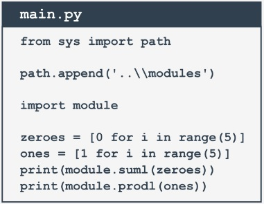
```
from sys import path

path.append('..\\modules')

import module

zeroes = [0 for i in range(5)]
ones = [1 for i in range(5)]
print(module.suml(zeroes))
print(module.prodl(ones))
```  
  
Nota:  
  
- Se ha duplicado la ```\``` dentro del nombre de la carpeta, sabes por qué?  
  
Debido a que una diagonal invertida se usa para escapar de otros caracteres, si deseas obtener solo una diagonal invertida,  
debes escapar.  
  
- hemos utilizado el nombre relativo de la carpeta: esto funcionará si el archivo *main.py* directamente desde la carpeta de inicio, y no funcionará si el directorio actual no se ajusta a la ruta relativa; siempre puedes usar una ruta absoluta, como esta:  
  
```
path.append('C\\Users\\user\\py\\modules')
```  
  
- Hemos usado el método ```append()```, la nueva ruta ocupará el último elemento en la lista de rutas; si no te gusta la idea, puedes usar en lugar de ello el método ```insert()```.  
  
  
## **Tu primer paquete: paso 1**  
  
Imagina que en un futuro no muy lejano, tu y tus socios escriben una gran cantidad de funciones en Python.  
  
Tu equipo decide agrupar las funciones en módulos separados, y este es el resultado final:  
  
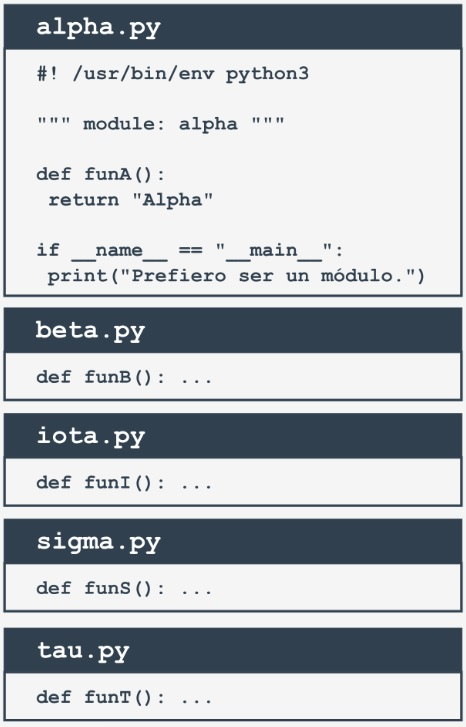  
```
#! /usr/bin/env python3

""" module: alpha """

def funA():
    return "Alpha"

if __name__ == "__main__":
    print("Yo prefiero ser un módulo")
```
  
Nota: hemos presentado todo el contenido solo para el módulo *alpha.py*, supongamos que todos los módulos tienen un aspecto  
similar (contienen una función denominada ```funX```, donde *X* es la primera letra del nombre del módulo).  
  
  
## **Tu primer paquete: paso 2**  
  
De repente, alguien se da cuenta de que estos módulos forman su propia jerarquía, por lo que colocarlos a todos en una estructura  
plana no será una buena idea.  
  
Después de algo de discusión, el equipo llega a la conclusión de que los módulos deben agruparse. Todos los participantes están de  
acuerdo en que la siguiente estructura de árbol refleja perfectamente las relaciones mutias entre los módulos:  
  
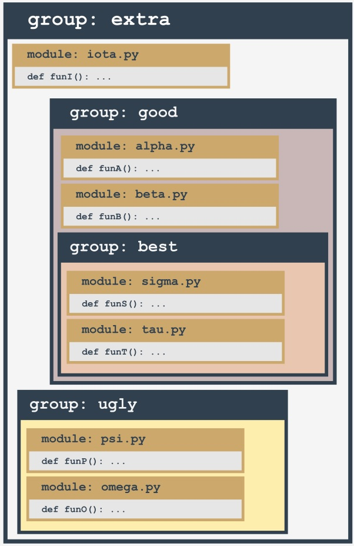  
  
Repasemos esto de abajo hacia arriba:  
  
- El grupo *ugly* contiene dos módulos: *psi* y *omega*.  
- El grupo *best* contiene dos módulos: *sigma* y *tau*.  
- El grupo *good* contiene dos módulos: (*alpha* y *beta*) y un subgrupo (*best*).  
- el grupo *extra* contiene dos subgrupos: (*good* y *bad*) y un módulo (*iota*).  
  
Se ve mal? de ninguna manera: analiza la estructura cuidadosamente. Se parece a algo, no?  
  
Parece la **estructura de un directorio**.  
  
Construyamos un árbol que refleje las dependencias proyectadas entre los módulos.  
  
  
## **Tu primer paquete: paso 3**  
  
Así es como se ve el árbol actualmente:  
  
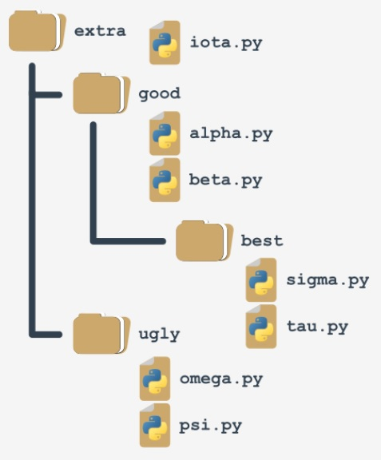  
  
Tal estructura es casi un paquete (en elsentido de Python). Carece del detalle fino para ser funcional y operativo. Lo completaremos  
en un momento.  
  
Si asumes que *extra* es el nombre de un **paquete recientemente creado** (piensa en el como la **raíz del paquete**), impondrá una  
regla de nomclatura que te permitirá nombrar claramente cada entidad del árbol.  
  
Por ejemplo:  
  
- La ubicación de una función llamada ```funcT()``` del paquete *tau* puede describirse como:  
```
extra.good.best.tau.funT()
```  
  
- Una función marcada como:  
```
extra.ugly.psi.funP()
```  
  
Proviene del módulo *psi* el cual esta almacenado en el subpaquete *ugly* del paquete *extra*.  
  
## **Tu primer paquete: paso 4**  
  
Ahora se deben responder dos preguntas:  
  
- 