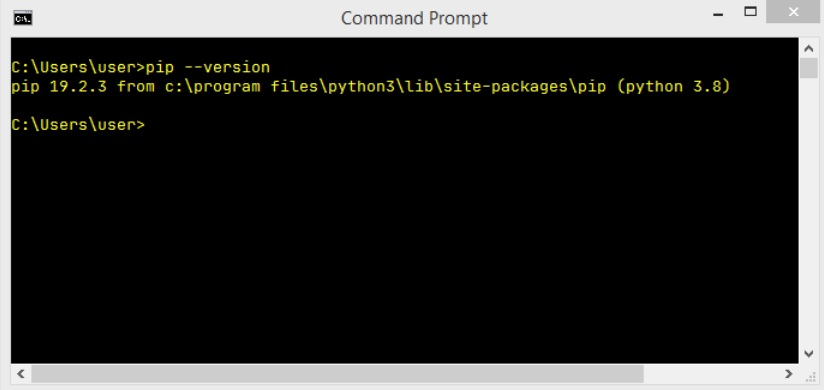

## **El ecosistema de paquetes de Python y cómo usarlo**  
  
Python es un instrumento muy poderoso: esperamos que ya lo hayas experimentado. Muchas personas de todo el mundo se sienten  
así y usan Python de forma regular para desarrollar lo que pueden hacer en muichos campos de actividad completamente diferentes.  
Esto significa que Python se ha convertido en una **herramienta interdisciplinaria** empleada en innumerables aplicaciones. No  
podemos pasar por todas las esferas en las que Python brillantemente muestra sus habilidades, así que permítenos contarte las más  
impresionantes.  
  
En primer lugar, Python se ha convertido en líder en investigación sobre inteligencia artificial. La minería de datos, una de las  
disciplinas científicas modernas más prometedoras, también utiliza Python. Matemáticos, psicólogos, genetistas, meteorólogos,  
lingüistas: todas estas personas ya usan Python, o si aún no lo hacen, estamos seguros de que lo harán muy pronto. No hay forma de  
escapar de esa tendencia.  

Por supuesto, no tiene ningún sentido hacer que todos los usuarios de Pyton escriban su código desde cero, manteniéndolos  
perfectamente aislados del mundo exterior y de los logros de otros programadores. Esto ser+ia antinatural y contraproducente.  
  
Lo más preferible y eficiente es permitir que todos los miembros de la comunidad de Python intercambien librement sus códigos y  
experiencias. En este modelo, nadie está obligado a empezar a trabajar desde cero, ya que existe una alta probabilidad de que alguien  
más haya estado trabajando en el mismo problema (o en uno muy similar).  
  
Como sabes, Python se creó como software de código abierto, y esto también funciona como una invitación para que todos los  
programadores mantengan todo el ecosistema de Python como un entorno abierto, amigable y libre. Para que el modelo funcione y  
evolucione, se deben proporcionar algunas herramientas adicionales, herramientas que ayuden a los creadores a publicar, mantener y  
cuidar su código.  
  
Estas mismas herramientas deberían ayudar a los usuarios a hacer uso del código, tanto el código ya existente como el código nuevo  
que aparece todos los días. Gracias a eso, escribir código nuevo para nuevos desafíos no es como construir una casa nueva,  
comenzando por los cimientos.  
  
Además, el programador es libre de modificar el código de otra persona para adaptarlo a sus propias necesidades y, de hecho, crear  
un producto completamente nuevo que pueda ser utilizad por otro desarrollador. Afortunadamente, el proceso parece no tener fin.  
  
Para hacer girar este mundo, se deben establecer y mantener en movimiento dos entidades básicas: **un repositorio centralizado** de  
todos los paquetes de software disponibles; y una herramienta que permite a los usuarios **acceder al repositorio**. Ambas entidades  
ya existen y se pueden utilizar en cualquier momento.  
  
## **El ecosistema de paquetes de Python y cómo usarlo**  
  
El repositorio (o *repo* para abreviar) que mencionamos se llama **PyPI** (es la abreviatura de Python Package Index) y lo mantiene un  
grupo de trabajo llamado Packaging Working Group, una parte de la Python Software Foundation, cuya tarea principal es apoyar a los  
desarroladores de Python en la diseminación de código eficiente.  
  
Puedes encontrar su sitio web aquí:  
  
  
El sitio web de PyPI (administrado por PWG) se encuentra en la dirección:  
  
  
En Julio de 2021 fuimos al sitio mencionado, y descubrimos que PyPI albergaba 315,000 proyectos, ue constan de más de 4,500,000  
archivos administradors por 520,000 usuarios.  
  
Estos tres números por sí solos muestran claramente la potencia de la comunidad de Python y la importancia de la cooperación entre  
desarrolladores.  
  
Debemos señalar que PyPI no es el único repositorio de Python existente. Por el contrario, hay mucos de ellos, creados para  
proyectos y dirigidos por muchas comunidades Python más grandes y más pequeñas. Es probable que algún día tu y tus colegas  
quieran **crear sus propios repositorios**.  
  
De todos modos, PyPI es el repositorio de Python más importante del mundo. Si modificamos un poco el dicho clásico, podemos  
afirmar que "todos los caminos de Python conducen a PyPI", y eso no es una exageracion.  
  
## **El repositorio de PyPI: La tienda de quesos**  
  
El repositorio de PyPI a veces se denomina **la tienda de quesos**.  
  
Te suena un poco extraño? No te preocupes, todo es perfectamente inocente.  
  
Nos referimos al repositorio como una tienda, por que vas allí por las mismas razones por las que vas a otras tiendas: para satisfacer  
tus necesidades. Si quieres un poco de queso, ve a la quesería. Si deseas una pieza de software, ve a la tienda de software.  
Afortunadamente, la analogía termina aquí: no necesitas dinero para sacar algún software de la tienda de repositorios.  
  
PyPI es completamente gratuito, puedes tomar un código y usarlo; no encontrarás cajero ni guardia de seguridad. Por supuesto, esto  
no te exime deser cortés y honesto. Debees obedecer todos los términos de la licencia, así que no te olvides de leerlos.  
  
OK, se comprende lo de la tienda, pero qué tiene que ver el queso con Python?  
  
The Chesse Shop (La Tienda de Quesos) es uno de los sketches más famosos de Monty Python. Representa la aventura surrealista de  
un inglés que intenta comprar queso. Desafortunadamente, la tienda que visita (llamada inmodestamente Ye National Chesse   
Emporium) no tiene queso en existencia.  
  
Por supuesto, está destinado a ser irónico. Como ya sabes, PyPI tiene una gran cantidad de software en stock y está disponible las 24  
horas del día, los 7 días de la semana. Tiene todo el derecho a identificarse como **Ye International Python Software Emporium**.  
 
  
## **El Repositorio de PyPI: La Tienda de Quesos (continuación)**  
  
PyPI es una tienda muy específica, no solo porque ofrece todos sus productos de forma gratuita, también requiere una herramienta  
especial para hacer uso de ella.  
  
Afortunadamente, esta herramienta también es gratuita, por lo que si deseas hacer tu propia hamburguesa con queso digital  
utilizando los productos que ofrece PyPI Shop, necesitarás una herramienta gratuita llamada *pip*.  
  
No, no has escuchado mal. Solo *pip*. Es otro acrónimo, claro, pero su naturaleza es más compleja que el PyPI mencionado  
anteriormente, ya que es un ejemplo de acrónimo recursivo, lo que significa que el acrónimo se refiere a sí mismo, lo que significa que  
explicarlo es un proceso infinito.  
  
Por qué? Por que *pip* significa *"pip instala paquetes"*, y el *pip* dentro de *"pip instala paquetes"* significa *"pip instala paquetes"* y...  
  
Detengámonos ahí. Gracias por tu cooperación.  
  
Por cierto, hay algunos otros acrónimos recursivos muy famosos. Uno de ellos es Linux, que se puede interpretar como *"Linux no es*  
*unix"*.  
  
  
## **Cómo instalar *pip***  
  
La pregunta que debería hacerse ahora es: cómo conseguir un cuchillo para un queso específico? En otras palabras, cómo  
asegurarse de que *pip* está instalado y listo para funcionar?  
  
La respuesta más precisa es "depende"  
  
Algunas instalaciones de Python vienen con *pip*, otras no. Además, no solo depende del sistema operativo que utilices, aunque este es  
un factor muy importante.  
  
Comencemos con MS Windows.  
  

## ***pip* en MS Windows**  
  
El instalador de Python para MS Windows ya contiene *pip*, por lo que no es necesario seguir ningún otro paso para instalarlo.  
Desafortunadamente, si la variable PATH está mal configurada, es posible que *pip* no esté disponible.  
  
Para verificar que no te hemos engañado, intenta hacer esto:  
  
- Abre la consola de Windows (*CMD* o *PowerShell*, lo que sea que prefieras)
- Ejecuta el siguiente comando:  
```
pip --version
```  
  
- En el escenario más optimista (y realmente queremos que eso suceda) verás algo como esto:  
  
  
  
- La ausencia de este mensaje puede significar que la variable PATH apunta incorrectamente a la ubicación de los binarios de  
Python o no apunta a ellos en absoluto; por ejemplo, nuestra variable PATH contiene la siguiente subcadena:  
```
C:\Program Files\Python3\Scripts\;C:\Program Files\Python3\;
```  
  
- La forma más fácil de reconfigurar la variable PATH es **reinstalar Python**, indicando al instalador que lo configure por ti.  

  
## ***pip* en Linux**  
  
Diferentes distribuciones de Linux puede comportarse de manera diferente cuando se trata de usar *pip*. Algunas de ellas (como  
*Gentoo*), que están estrechamente vinculadas a Python y que lo usan internamente, pueden tener *pip* preinstalado y están  
instantáneamente listas para funcionar.  
  
No olvides que algunas distribuciones de Linux pueden utilizar más de una versión de Python al mismo tiempo, por ejemplo, un  
Python 2 y un Python 3 coexistiendo uno al lado del otro. Estos sistemas pueden iniciar Python 2 como la versión predeterminada y  
puede ser necesario especificar explícitamente el nombre del programa como Python3. En este caso, puede haber dos *pip* diferentes  
identificados como *pip* (o *pip2*) y *pip3*. Compruébalo cuidadosamente.  
  
Abre la ventana de la terminal y emite el siguiente comando:  
```
pip --version
```  
  
  
  
Una respuesta similar a la que se muestra en la imagen anterior determina que has iniciado *pip* desde Python 2, por lo que el siguiente  
intento debería verse de la siguiente manera:  
  
  
  
Como puedes ver, ahora estamos seguros de que estamos utilizando la versión adecuada de *pip*.  
  

## ***pip* en Linux: continuación**  
  
Desafortunadamente, algunas distribuciones de Linux no tienen *pip* preinstalado, incluso si Python está instalado por defecto  
(algunas versiones de Ubuntu pueden comportarse de esta manera). En este caso, tienes dos posibilidades:  
  
- Instalar *pip* como un paquete del sistema usando un administrador de paquetes dedicado (por ejemplo, *apt* en sistemas tipo  
Debian).  
- Instalar *pip* usando mecanismos internos de Python.  

El primero es definitivamente mejor. Aunque hay algunos scripts inteligentes que pueden descargar e instalar *pip* ignorando el  
sistema operativo, te recomendamos que no los utilices. Este método puede causarte problemas.  
  
Observa, intentamos iniciar *pip3* y fallamos. Nuestro sistema operativo (esta vez usamos *Ubuntu Budgie*) sugirió usar *apt* para instalar  
el paquete llamado *python3-pip*:  
  
  
  
Este es un buen consejo y lo seguiremos, pero hay que decir que necesitaremos derechos administrativos para hacerlo. No olvides que  
diferentes distribuciones de Linux pueden usar diferentes administradores de paquetes (por ejemplo, podría ser *pacman* si usas Arch  
Linux, o *yum* usado por distribuciones derivadas de Red Hat).  
  
De cualquier manera, todos estos métodos deberían ayudarte en tener *pip* (o *pip3*) instalado y funcionando.  
  
Observa lo que sucedió cuando seguimos la sugerencia del sistema operativo:  
  
  
  
Como puedes ver, el sistema operativo decidió instalar no solo *pip* en sí, sino también un par de componentes adicionales necesarios  
para *pip*. Esto es normal, no te alarmes.  
  

## ***pip* en Linux: continuación**  
  
Cuando *apt* termina su trabajo, finalmente podemos utilizar *pip3*:  
  
  
  
Si eres un usuario de Mac y has instalado Python 3 usando el instalador *brew*, *pip* ya está presente en tu sistema y listo para funcionar.  
Compruébelo emitiendo el comando mencionado anteriormente:  
```
pip3 --version
```  
  
y espera la respuesta.  
  
Esto es lo que nosotros vimos:  
  
  
  
  
## **Dependencias**  
  
Ahora que estamos seguros de que *pip* está listo para usarse, vamos a limitar nuestro enfoque a MS Windows solamente, ya que su  
comportamiento es (debería ser) el  mismo en todos los sistemas operativos, pero antes de comenzar, debemos explicar un asunto  
importante e informarte sobre las **dependencias**.  
  
Imagina que has creado una brillante aplicación de Python llamada *redsuspenders*, capaz de predecir los tipos de cambio de la bolsa  
de valores con un 99% de precisión (por cierto, si realmente lo haces, contáctanos de inmediato).  
  
Por supuesto, has utilizado algún código existente para lograr este objetivo, por ejemplo, tu aplicación importa un paquete llamado  
*nyse* que contiene algunas funciones y clases cruciales. Además, el paquete *nyse* importa otro paquete llamado *wallstreet*, mientras  
que el paquete *wallstreet* importa otros dos paquetes esenciales llamados *bull* y *bear*.  
  
Como probablemente ya habrás adivinado, las conexiones entre estos paquetes son cruciales, y si alguien decide usar tu código (pero  
recuerda, ya lo hemos reclamado primero) también tendrás que asegurarte de que todos los paquetes requeridos están en su lugar.  
  
Para abreviar, podemos decir que **la dependencia es un fenómeno que aparece cada vez que vas a utilizar un software que**  
**depende de otro software**. Ten en cuenta que la dependencia puede incluir (y generalmente incluye) más de un nivel de desarrollo  
de software.  
  
Significa esto que un usuario potencial del paquete *nyse* está obligado a rastrear todas las dependencias e instalar manualmente  
todos los paquetes necesarios? esto sería horrible, no?  
  
Sí definitivamente es horrible, por lo que no deberías sorprenderse de que el proceso de cumplir arduamente con todos los  
rquisitos posteriores tenga su propio nombre, y se llame *infierno de dependencias*. 
 
Cómo nos ocupamos de eso? Todos los usuarios están condenados a visitar el infierno para ejecutar el código por primera vez?  
  
Afortunadamente no, *pip* puede hacer todo esto por ti. Puede descubrir, identificar y resolver todas las dependencias. Además, puede  
hacerlo de la manera más inteligente, evitando descargas y reinstalaciones innecesarias.  
  
  
## **Cómo usar *pip***  
  
Ahora estamos listos para preguntarle a *pip* qué puede hacer por nosotros. Hagámoslo, emite el siguiente comando:  
```
pip help
```  
  
y espera la respuesta de *pip*. Así es como se mira:  
  
  
  
No olvides que puedes necesitar reemplazar *pip* por *pip3* si tu entorno lo requiere.  
  
La lista producida por *pip* resume todas las operaciones disponibles, y la última de ellas es ```help```, la cual acabamos de usar.  
  
Si deseas saber más sobre cualquiera de las operaciones enumeradas, puedes utilizar la siguiente forma de invocación de *pip*:  
```
pip help (operación o comando)  
```  
  
Por ejemplo, la línea:
```
pip help install
```  
  
te mostrará información detallada sobre el uso y la parametrización del comando ```install```.  
  
Si deseas saber qué paquetes de Python se han instalado hasta ahora, puedes usar la operacin ```list```, justo como aquí:  
```
pip list
```  
  
El resultado que verás es bastante impredecible. No te sorprendas si el contenido de tu pantalla termina siendo completamente  
diferente. El nuestro es el siguiente:  
  
  
  
Como puedes ver, hay dos columnas en la lista, una muestra el nombre del paquete instalado y la otra muestra la versión del  
paquete. No podemos predecir el estado de tu instalación de Python.  
  
Lo único que sabemos con certeza es que tu lista contiene las dos líneas que vemos en nuestra lista: *pip* y *setuptools*. Esto sucede  
porque el sistema operativo está convencido de que un usuario que desee *pip* probablemente necesitará las *setuptools*(*herramientas*  
*de configuración*). No está mal.  
  

## **Cómo usar *pip*: continuación**  
  
La 