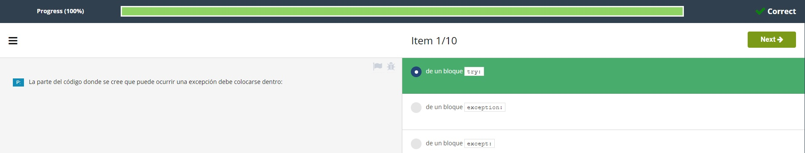
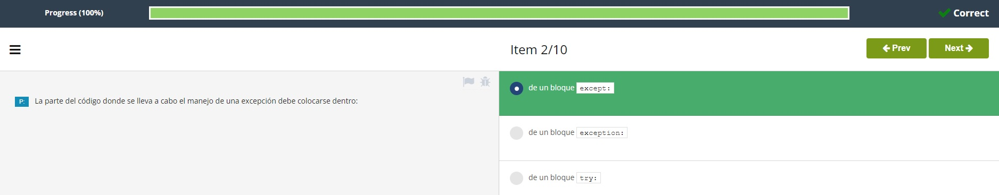
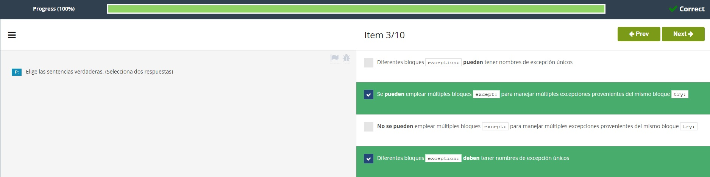
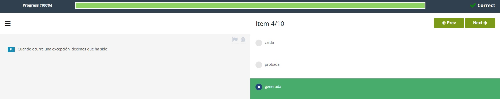
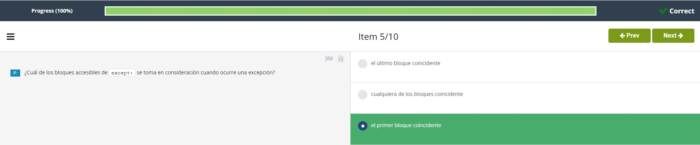
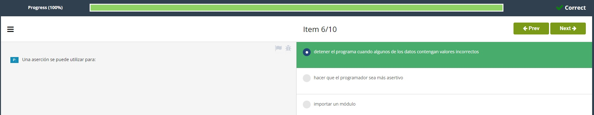
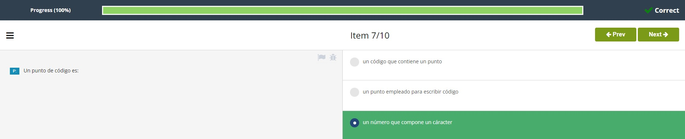
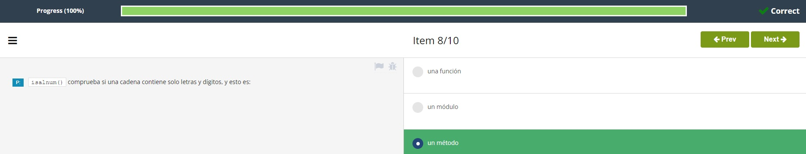
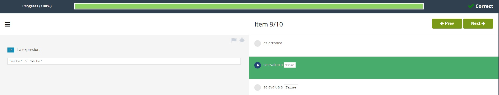
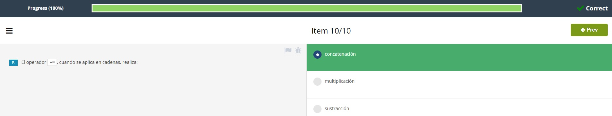

# **Test Modulo 2**  

1. La parte del código donde se cree que puede ocurrir una excepción debe colocarse dentro:  
  
<br></br>

2. La parte del código donde se lleva a cabo el manejo de una excepción debe colocarse dentro:  
  
<br></br>

3. Elige las sentencias *verdaderas*. (selecciona **DOS** respuestas)  
  
<br></br>

4. Cuando ocurre una excepción, decimos que ha sido:  
  
<br></br>

5. Cuál de los bloques accesibles de ```except:``` se toma en consideración cuando ocurre una excepción?  
  
<br></br>

6. Una aserción se puede utilizar para:  
  
<br></br>

7. Un punto de código es:  
  
<br></br>

8. ```isalnum()``` comprueba si una cadena contiene solo letras y dígitos, y esto es:  
  
<br></br>

9.  La expresión: ```'mike' > 'Mike```:  
  
<br></br>

10. El operador ```+=```, cuando se aplica en cadenas, realiza:  
  
<br></br>