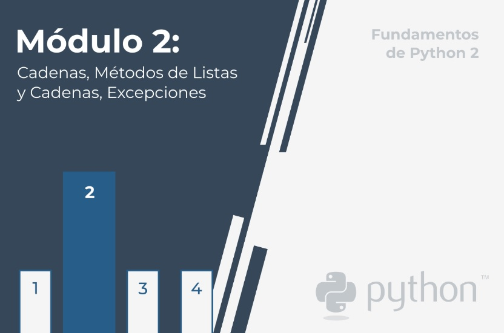

# **Fundamentos de Python 2: Módulo 2**  
  
 
## Cadenas, métodos de listas y excepciones.  
  
En este módulo, aprenderás sobre:  
  
- Caracteres, cadenas y estándares de codificación.  
- Cadenas frente a Listas: similitudes y diferencias.  
- Métodos de listas.
- Métodos de cadenas.  
- Cómo Python maneja los errores en tiempo de ejecución.
- Controlando el flujo de errores mediante ```try``` y ```except```.  
- La jerarquía de las excepciones.

 
 
#  
1. [Seccion 1 - Carácteres y estándares de codificación](./Seccion1/_Seccion1.md)   

2. [Seccion 2 - ](./Seccion2/_Seccion2.md)

3. [Seccion 3 -](./Seccion3/_Seccion3.md)

4. [Seccion 4 -](./Seccion4/_Seccion4.md)

5. [Seccion 5 -](./Seccion5/_Seccion5.md)

6. [Seccion 6 -](./Seccion6/_seccion6.md)

7. [Seccion 7 -](./Seccion7/_Seccion7.md)