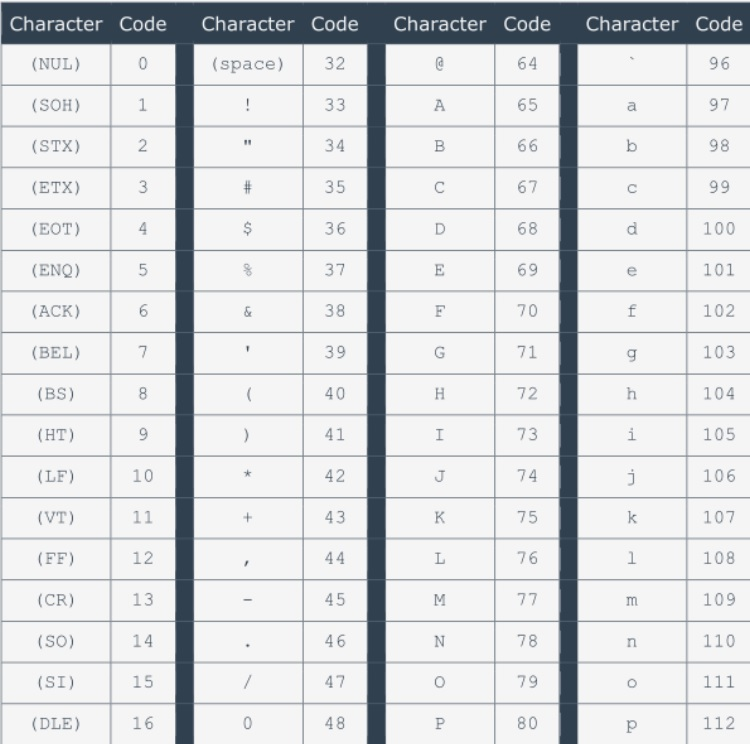
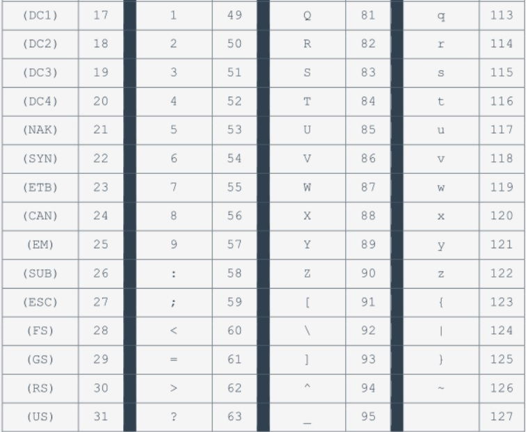

## **Cómo las computadoras entienden los caracteres individuales**  
Has escrito algunos programas interesantes desde que comenzó este curso, pero todos ellos han procesado solo un tipo de datos: los  
numéricos. Como sabes (puedes ver esto en todas partes) muchos datos de la computadora no son números: nombres, apellidos,  
direcciones, títulos, poemas, documentos científicos, correos electronicos, sentencias judiciales, confesiones de amor y mucho, mucho más.  

  

Todos estos datos deben ser almacenados, ingresados, emitidos, buscados y transformados por computadoras como cualquier otro  
dato, sin importar si son caracteres únicos o enciclopedias de múltiples volúmenes.  

Cómo es esto posible?  

Cómo puedes hacerlo en Python? Esto es lo que discutiremos ahora. Comencemos con como las computadoras entienden los  
caracteres individuales.  

**Las computadoras almacenan los caracteres como números**. Cada carácter utilizado por una computadora corresponde a un  
número único, y viceversa. Esta asignación debe incluir más caracteres de los que podrías esperar. Muchos de ellos son invisibles para  
los humanos, pero esenciales para las computadoras.  

Algunos de estos caracteres se llaman **espacios en blanco**, mientras que otros se nombran **caracteres de control**, porque su  
propósito es controlar dispositivos de entrada y salida.  

Un ejemplo de un espacio en blanco que es completamente invisible a simple vista es un código especial, o un par de códigos  
(diferentes sistemas operativos pueden tratar este asunto de manera diferente), que se utilizan para marcar el final de las líneas  
dentro de los archivos de texto.  

Las personas no ven este signo (o estos signos), pero pueden observar el efecto de su aplicación donde ven un salto de línea.  

Podemos crear prácticamente cualquier cantidad de asignaciones de números con caracteres, pero la vida en un mundo en el que  
cada tipo de computadora utiliza una codificación de caracteres diferentes no sería muy conveniente. Este sistema ha llevado a la  
necesidad de introducir un estándar universal y ampliamente aceptado, implementado por (casi) todas las computadoras y sistemas  
operativos en el mundo.  

El denominado **ASCII** (por sus siglas en inglés **American Standard Code for Information Interchangue**). El Código Estándar   
Americano para Intercambio de Información es el más utilizado, y es posible suponer que casi todos los dispositivos modernos (como  
computadoras, impresoras, teléfonos móviles, tabletas, etc.) usan este código.  

El código proporciona espacio para **256 caracteres diferentes**, pero solo nos interesan loas primeros 128. Si deseas ver como se  
construye el código, mira la tabla a continuación. Haz clic en la tabla para ampliarla. Mírala cuidadosamente: hay algunos datos interesantes. Observa el código del carácter más común: el *espacio*. El cual es el *32*.  

  

Ahora verifica el código de la letra minúscula *a*. El cual es *97*. Ahora encuentra la *A* mayúscula. Su código es *65*. Ahora calcula la  
diferencia entre el código de la *a* y de la *A*. Es igual a *32*. Ese es el código del *espacio*. Interesante, no es así?  

También ten en cuenta que las letras están ordenadas en el mismo orden que en el Alfabeto Latino.  

## **I18N**  

Ahora, el alfabeto latino no es suficiente para toda la humanidad. Los usuarios de ese alfabeto son minoría. Era necesario idear algo  
más flexible y capaz que ASCII, algo capaz de hacer que todo el software del mundo sea susceptible de **internacionalización**, porque  
diferentes idiomas usan alfabetos completamente diferentes, y a veces estos alfabetos no son tan simples como el latino.  

La palabra *internacionalización* se acorta comúnmente a **I18n**.  

Por qué? Observa con cuidado, hay una */* al inicio de la palabra, a continuación hay *18* letras diferentes, y una *N* al final.  

A pesar del origen ligeramente humorístico, el término se utiliza oficialmente en muchos documentos y normas.  

El software **I18N** es un estándar en los tiempos actuales. Cada programa tiene que ser escrito de una manera que permita su uso en  
todo el mundo, entre diferentes culturas, idiomas y alfabetos.  

**El código ASCII emplea ocho bits para cada signo**. Ocho bits significan 256 caracteres diferentes. Los primeros 128 se usan para el  
alfabeto latino estándar (tanto en mayúsculas como en minúsculas). Es posible colocar todos los otros caracteres utilizados en todo el  
mundo a los 128 lugares restantes?  

No, no lo es.  

## **Puntos de código y páginas de códigos**  

Necesitamos un nuevo término: un **punto de código**.  

Un punto de código **es un numero que compone un caracter**. Por ejemplo, el *32* es un punto de código que compone un **espacio** en  
codificación ASCII. Poemos decir que el código ASCII estándar consta de 128 puntos de código.  

Como el ASCII estándar ocupa 128 de 256 puntos de código posibles, solo puedes hacer uso de los 128 restantes.  

No es suficiente para todos los idiomas posibles, pero puede ser suficiente para un idioma o para un pequeño grupo de idiomas  
similares.  

Se puede **establecer la mitad superior de los puintos de código de manera diferente para diferentes idiomas**? Si, por supuesto.  
A tal concepto se le denomina una **página de códigos**.  

Una página de códigos es un **estándar para usar los 128 puntos de código superiores para almacenar caracteres específicos**. Por  
ejemplo, hay diferentes páginas de códigos para Europa Occidental y Europa del Este, alfabetos cirílicos y griegos, idiomas árabe y  
hebreo, etc.  

Esto significa que el mismo punto de código puede formar diferentes caracteres cuando se usa en diferentes páginas de códigos.  

Por ejemplo, el punto de código *200* forma una Č (una letra usada por algunas lenguas eslavas) cuando lo utiliza la página de códigos  
ISO/IEC 8859-2, pero forma un Ш (una letra cirílica) cuando es usado por la página de códigos ISO/IEC 8859-5.  

En consecuencia, para determinar el significado de un punto de código específico, debes conocer la página de códigos de destino.  

En otras palabras, los puntos de código derivados del código de páginas son ambiguos.  

## **Unicode**  

Las páginas de códigos ayudaron a la industria informática a resolver problemas de I18N durante algún tiempo, pero pronto resultó  
que no serían una solución permanente.  

El concepto que resolvió el problema a largo plazo fue el **Unicode**.  

**Unicode asigna caracteres únicos (letras, guiones, ideogramas, etc.) a más de un millón de puntos de código**. Los primeros 128  
puntos de código Unicode son idénticos a ASCII, y los primeros 256 puntos de código Unicode son idénticos a la página de códigos  
ISO/IEC 8859-1 (una página de códigos diseñada para idiomas de Europa occidental).  

## **UCS-4**  

El estándar Unicode no dice nada sobre como codificar y almacenar los caracteres en la memoria y los archivos. Solo nombra todos  
los caracteres disponibles y los asigna a planos (un grupo de caracteres de origen, aplicación o naturaleza similares).  

Existe más de un estándar que describe las técnicas utilizadas para implementar Unicode en computadoras y sistemas de  
almacenamiento informaticos eales. El más general de ellos es **USC-4**.  

El nombre proviene de **Universal Character Set** (Conjunto de Caracteres Universales).  

**USC-4 emplea 32 bits (4 bytes) para almacenar cada carácter**, y el código es solo el número único de los puntos de código  
Unicode. Un archivo que contiene texto codificado UCS-4 puede comenzar con un BOM (byte order mark- marca de orden de bytes),  
una combinación no impribible de bits que anuncia la naturaleza del contenido del archivo. Algunas utilidades pueden requerirlo.  

Como puedes ver, UCS-4 es un estándar bastante derrochador: aumenta el tamaño de un texto cuatro veces en comparación con el  
estándar ASCII. Afortunadamente, hay formas más inteligentes de codificar textos Unicode.  

## **UTF-8**  

Uno de los más utilizados es **UTF-8**.  

El nombre se deriva de **Unicode Transformation Format** (Formato de Transformación Unicode).  

El concepto es muy inteligente. **UTF-8 emplea tantos bits para cada uno de los puntos de código como realmente necesita para**  
representarlos.  

Por ejemplo:  
- Todos los caracteres latinos (y todos los caracteres ASCII estándar) ocupan ocho bits.  
- Los caracteres no latinos ocupan 16 bits.  
- Los ideógrafos CJK (China-Japón-Korea) ocupan 24 bits.  

Debido a las características del método utilizado por UTF-8 para almacenar los puntos de código, no es necesario usar el BOM, pero  
algunas de las herramientas lo buscan al leer el archivo, y muchos editores lo configuran durante el guardado.  

Python 3 es totalmente compatible con Unicode y UTF-8:  
- Puedes usar caracteres codificados Unicode / UTF-8 para nombrar variables y otras entidades.  
- Puedes usarlos durante todas las entradas y salidas.  

Esto significa que Python3 está completamente internacionalizado.  

## **Puntos clave**  

1. Las computadoras almacenan caracteres como números. Hay más de una forma posible de codificar caracteres, pero solo algunas  
de ellas ganaron popularidad en todo el mundo y se usan comúnmente en TI: estas son **ASCII** (se emplea principalmente para codificar  
el alfabeto latino y algunos de sus derivados) y **UNICODE** (capaz de codificar prácticamente todos los alfabetos que utilizan los seres humanos).  

2. Un número correspondiente a un carácter en particular se llama **punto de código**.  

3. UNICODE utiliza diferentes formas de codificación cuando se trata de almacenar los caracteres usando archivos o memoria de  
computadora: dos de ellas son **UCS-4** y **UTF-8** (esta última es la más común ya que desperdicia menos espacio de memoria).  

    

#  
[Ejercicios](Sec1-ej.md)
  

[Soluciones](Sec1-ejsol.md)  

#

[Volver a: Módulo 2 - Cadenas, métodos de listas y excepciones](../README.md)