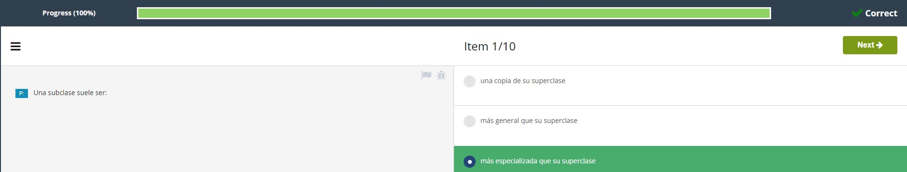
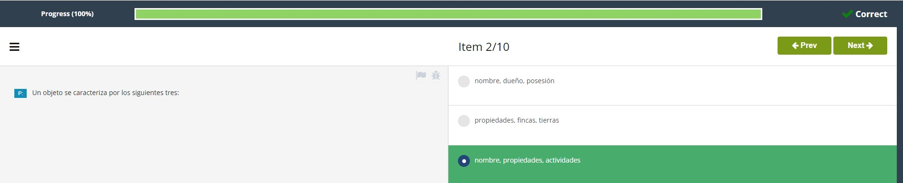
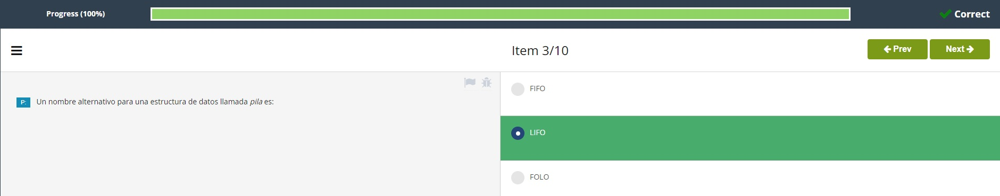
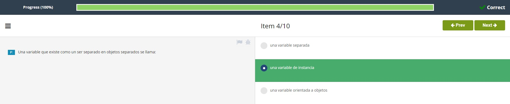
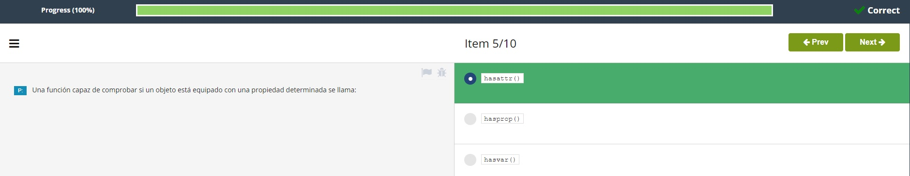
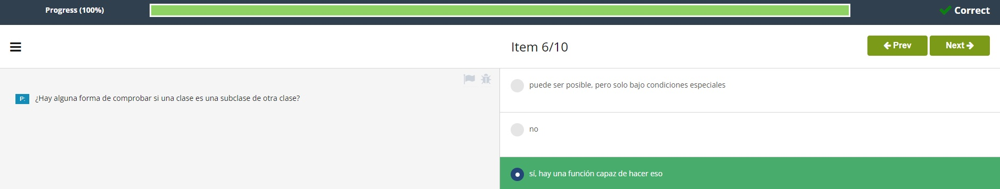
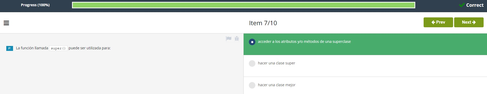
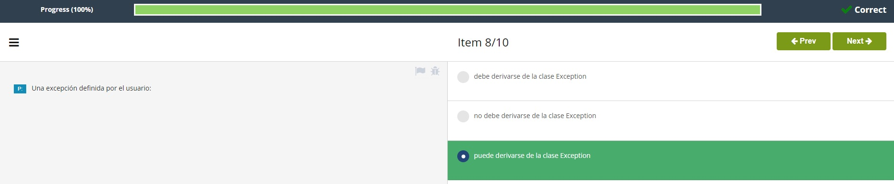
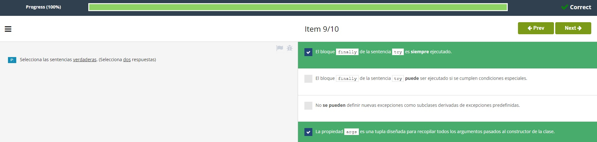
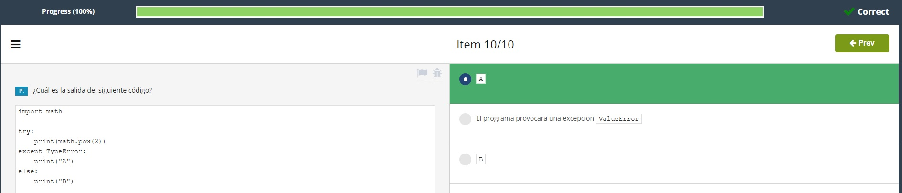

# **Soluciones Test Modulo 3**  
# **Test Modulo 3**  

1. Una subclase suele ser: 
<p align="center">

</p>  

<br></br>

2. Un objeto se caracteriza por los siguientes tres:  
<p align="center">

</p>  

<br></br>

3. Un nombre alternativo para una estructura de datos llamada *pila* es:
<p align="center">

</p>  

<br></br>

4. Una variable que existe como un ser separado en objetos separados se llama: 
<p align="center">

</p>  

<br></br>

5. Una función capaz de comprobar si un objeto está equipado con una propiedad determinada se llama:
<p align="center">

</p>  

<br></br>

6. Hay alguna forma de comprobar si una clase es una subclase de otra clase?
<p align="center">

</p>  

<br></br>

7. La función llamada ```super()``` puede ser utilizada para: 
<p align="center">

</p>  

<br></br>

8. Una excepción definida por el usuario:
<p align="center">

</p>  

<br></br>

9. Selecciona las sentencias **verdaderas**. (selecciona **dos** respuestas)
<p align="center">

</p>  

<br></br>

10.  Cuál es la salida del siguiente código?  
<p align="center">

</p>  


<br></br>  

#
- [Volver al Test](TestM3.md)
#  
[Volver a: Módulo 3 - Programación Orientada a Objetos y Procesamiento de Archivos en Python](../README.md)