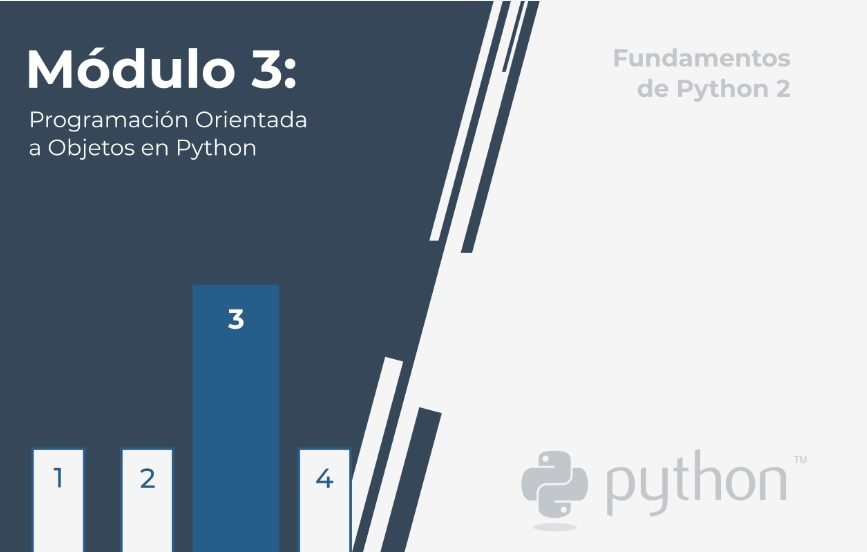

# **Fundamentos de Python 2: Módulo 3**  

  
    

## Módulo 3
**Programación orientada a objetos**

En este módulo, aprenderás sobre:  

- Conceptos básicos de programación orientada a objetos (POO)
- Las diferencias entre el enfoque procedimental y el orientado a objetos  
(motivaciones y beneficios).  
- Clases, objetos, propiedades y métodos.
- Cómo diseñar clases reutilizables y crear objetos.
- Herencia y polimorfismo.
- Las excepciones con objetos.

  

#   

1. [Seccion 1 - Los fundamentos de la POO](./Seccion1/_Seccion1.md)  
    - [Ejercicios](Seccion1/Sec1-ej.md)
  

1. [Seccion 2 - Un corto viaje desde el enfoque procedimental hacia el orientado a objetos](./Seccion2/_Seccion2.md)
    - [Ejercicios](Seccion2/Sec2-ej.md)
    - [Laboratorio 1](Seccion2/Sec2-Lab1.md)
    - [Laboratorio 2](Seccion2/Sec2-Lab2.md)
    - [Laboratorio 3](Seccion2/Sec2-Lab3.md)
  

1. [Seccion 3 - PPO: Propiedades](./Seccion3/_Seccion3.md)
    - [Ejercicios](Seccion3/Sec3-ej.md)
  

1. [Seccion 4 - PPO: Métodos](./Seccion4/_Seccion4.md)  
    - [Ejercicios](Seccion4/Sec4-ej.md)
    - [Laboratorio 1](Seccion4/Sec4-Lab1.md)
    - [Laboratorio 2](Seccion4/Sec4-Lab2.md)
    - [Laboratorio 3](Seccion4/Sec4-Lab3.md)
    - [Laboratorio 4](Seccion4/Sec4-Lab4.md)
  

1. [Seccion 5 - Fundamentos de POO: Herencia](./Seccion4/_Seccion4.md)  
    - [Ejercicios](Seccion4/Sec4-ej.md)
  

1. [Seccion 6 - Excepciones una vez más](./Seccion4/_Seccion4.md)  
    - [Ejercicios](Seccion4/Sec4-ej.md)
  

#   

- [Test de ensayo](EjerciciosTestModulo3/TestM3.md)  
- [Test de ensayo (soluciones)](EjerciciosTestModulo1/soltest_mod1.md)

   

- [Examen Módulo 1](ExamenModulo3/ExamenM3.md)
- [Examen Módulo 1 (soluciones)](./ExamenModulo3/solex_mod3.md)

#  

    

- [PCAP2 Certified Associate in Python Programming: inicio](../README.md)

