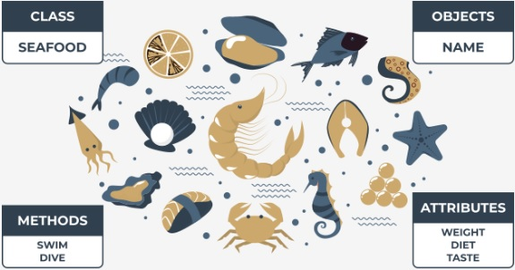
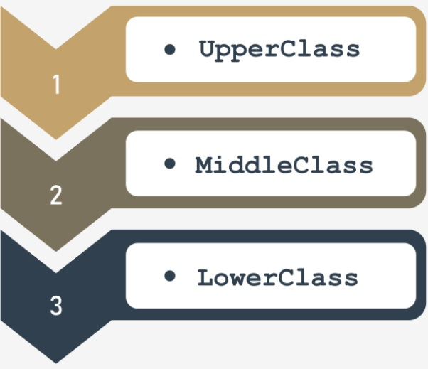
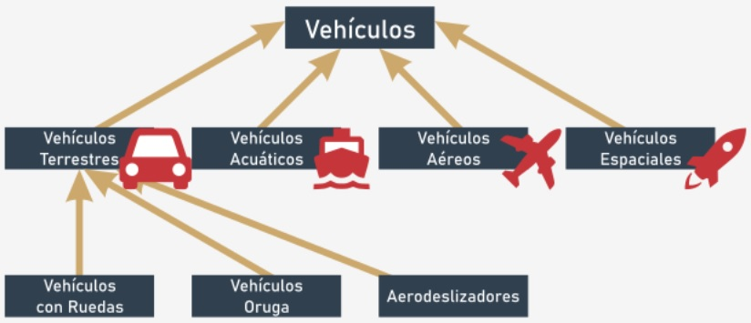

## **Los conceptos básicos del enfoque orientado a objetos**
Demos un paso fuera de la programación y las computadoras, y analicemos temas de programación orientada a objetos.  

Casi todos los programas y técnicas que has utilizado hasta ahora pertenecen al estilo de programación procedimental. Es cierto que  
has utilizado algunos objetos incorporados, pero cuando nos referimos a ellos, se mencionan lo mínimo posible.  

La programación procedimental fue el enfoque dominante para el desarrollo de software durante décadas de TI, y todavía se usa en la  
actualizda. Además, no va a desaparecer en el futuro, ya que funciona muy bien para proyectos específicos (en general, no muy  
complejos y no grandes, pero existen muchas excepciones a esa regla).  

El enfoque orientado a objetos es bastante joven (mucho más joven que el enfoque procedimental) y es particularmente útil cuando se  
aplica a proyectos grandes y complejos llevados a cabo por grandes equipos formados por muchos desarrolladores.  

Este tipo de programación en un proyecto facilita muchas tareas importantes, por ejemplo, dividir el proyecto en partes pequeñas e  
independientes y el desarrollo independiente de diferentes elementos del proyecto.  

**Python es una herramienta universal para la programación procedimental y orientada a objetos**. Se puede utilizar con éxito en  
ambos enfoques.  

Además, puedes crear muchas aplicaciones útiles, incluso si no se sabe nada sobre clases y objetos, pero debes tener en cuenta que  
algunos de los problemas (por ejemplo, el manejo de la interfaz gráfica de usuario) puede requerir un enfoque estricto de objetos.  

Afortunadamente, la programación orientada a objetos es relativamente simple.  

  
  

## **Enfoque procedimental frente al enfoque orientado a objetos**  
En el **enfoque procedimental**, es posible distinguir dos mundos diferentes y completamente separados: **el mundo de los datos y el**  
**mundo del código**. El mundo de los datos está poblado con variables de diferentes tipos, mientras que el mundo del código está  
habilitado por códigos agrupados en módulos y funciones.  

Las funciones pueden usar datos, pero no al reves. Además, las funciones pueden abusar de los datos, es decir, usar el valor de  
manera no autorizada (por ejemplo, cuando la función seno recibe el saldo de una cuenta bancaria como parámetro)  

Los datos no pueden usar funciones. Pero es esto completamente cierto? hay algunos tipos especiales de datos que pueden usar  
funciones?  

Si, los hay, los llamados métodos. Estas son funciones que se invocan desde dentro de los datos, no junto con ellos. Si puedes ver esta  
distinción, has dado el primer paso en la programación de objetos.  

El **enfoque orientado a objetos** sugiere una forma de pensar completamente diferente. Los datos y el código están encapusulados  
juntos en el mismo mundo, divididos en clases.  

Cada **clase es como una receta que se puede usar cuando quieres crear un objeto útil**. Puedes producir tantos objetos como  
necesites para resolver tu problema.  

Cada objeto tiene un conjunto de rasgos (se denominan propiedades o atributos; usaremos ambas palabras como sinónimos) y es  
capaz de realizar un conjunto de actividades (que se denominan métodos).  

Las recetas pueden modificarse si son inadecuadas para fines específicos y, en efecto, pueden crearse nuevas clases. Estas nuevas  
clases heredan propiedades y métodos de los originales, y generalmente agregan algunos nuevos, creando nuevas herramientas más  
específicas.  

**Los objetos son encarnaciones** de las ideas expresadas en clases, como un pastel de queso en tu plato, es una encarnación de la  
idea expresadea en una receta impresa en un viejo libro de cocina.  

Los objetos interactúan entre sí, intercambian datos o activan sus métodos. Una clase construida adecuadamente (y, por lo tanto, sus  
objetos) puede proteger los datos sensibles y ocultarlos de modificaciones no autorizadas.  

No existe un límite claro entre los datos y el código: viven como uno solo dentro de los objetos.  

Todos estos conceptos no son tan abstractos como pudieras pensar al principio. Por el contrario, todos están tomados de  
experiencias de la vida real y, por lo tanto, son extremadamente útiles en la programación de computadoras: no crean vida artificial,  
**reflejan hechos reales, relaciones y circunstancias**.  

  
    

## **Jerarquías de clase**  
La palabra *clases* tiene muchos significados, pero no todos son compatibles con las ideas que queremos discutir aquí. La *clase* que  
nos concierne es como una *categoría*, com resultado de similitudes definidas con precisión.  

Intentaremos señalar algunas clases que son buenos ejemplos de este concepto.  

  

Veamos por un momento los vehículos. Todos los vehículos existentes (y los que aún no existen) están **relacionados por una sola**  
**caracteristica importante**: la capacidad de moverse. Puedes argumentar que un perro también se mueve; es un perro un vehículo?  
No lo es. Tenemos que mejorar la definición, es decir, enriquecerla con otros criterios, distinguir los vehículos de otros seres y crear  
una conexión más fuerte. Consideremos las siguientes circunstancias: los vehículos son entidades creadas artificialmente que se  
utilizan para el transporte, movidos por fuerzas de la naturaleza y dirigidos (conducidos) por humanos.  

Según esta definición, un perro no es un vehículo.  

La clase *Vehículos* es muy amplia. Tenemos que definir **clases especializadas**. Las clases especializadas son las **subclases**. La clase  
*Vehículos* será una **superclase** para todas ellas.  

Nota: **La jerarquía crece de arriba hacia abajo, como raíces de árboles, no ramas. La clase más general y más amplia siempre está  
en la parte superior (la superclase) mientras que sus descendientes se encuentran abajo (las subclases).  

A estas alturas, probablemente puedas señalar algunas subclases potenciales para la superclase *Vehículos*. Hay muchas  
clasificaciones posibles. Elegimos subclases basadas en el medio ambiente y decimos que hay (almenos) cuatro subclases:  
- Vehículos Terrestres.
- Vehículos Acuáticos.
- Vehículos Aéreos.
- Vehículos Espaciales.  

Con este ejemplo, discutiremos solo la primera subclase: Vehículos Terrestres. Si lo deseas, puedes continuar con las clases restantes.  

Los vehículos terrestres pueden dividirse aún más, según el método con el que impactan en el suelo. Entonces, podemos enumerar:  
- Vehículos con ruedas.
- Vehículos oruga.
- Aerodeslizadores.  

La figura ilustra la jerarquía que hemos creado.  

Ten en cuenta la dirección de las flechas: siempre apuntan a la superclase. La clase de nivel superior es una excepción: no tiene su  
propia superclase.
  

  
[Ejercicios](/Modulo1/Seccion1/Sec1-ej.md)
  
[Soluciones](/Modulo1/Seccion1/Sec1-ejsol.md)  

#  

[Volver a: Módulo 3 - Programación Orientada a Objetos y Procesamiento de Archivos en Python](../README.md)