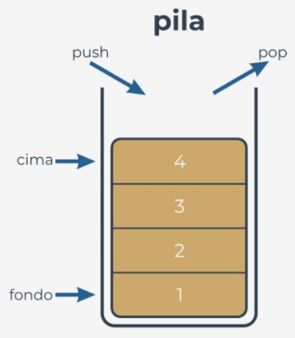

# ***Un corto viaje desde el enfoque procedimental hacia el orientado a objetos***  
<br></br>  

## **Qué es una pila?**  
**Una pila es una estructura desarrollada para almacenar datos de una manera muy específica**. Imagina una pila de monedas. No  
puedes poner una moneda en ningún otro lugar sino en la parte superior de la pila.  

Del mismo modo, no puedes sacar una moneda de la pila desde ningún lugar que no sea la parte superior de la pila. Si deseas obtener  
la moneda que se encuentra en la parte inferior, debes eliminar todas las monedas de los niveles superiores.  

El nombre alternativo para una pila (pero solo en la terminología de TI) es **UEPS (LIFO son sus siglas en inglés)**.  

Es una abreviatura para una descripción muy clara del comportamiento de la pila: **Último en Entrar - Primero en Salir (Last in - First**  
**Out)**. La moneda que quedó en último lugar en la pila saldrá primero.  

**Una pila es un objeto** con dos operaciones elementales, denominadas convencionalmente **push** (cuando un nuevo elemento se  
coloca en la parte superior) y **pop** (cuando un elemento existente se retira de la parte superior).  

Las pilas se usan muy a menudo en muchos algoritmos clásicos, y es difícil imaginar la implementación de muchas herramientas  
ampliamente utilizadas sin el uso de pilas.  

<p align="center">

</p>  

Implementemos una pila en Python. Esta será una pila muy simple, y te mostraremos como hacerlo en dos enfoques independientes:  
de manera procedimental y orientado a objetos.  

Comencemos con el primero.  

<br></br>  


## **La pila: el enfoque procedimental**  
Primero, debes decidir como almacenar los valores que llegarán a la pila. Sugerimos utilizar el método más  
simple, y **emplear una lista** para esta tarea. Supongamos que el tamaño de la pila no está limitado de ninguna  
manera. Supongamos también que el último elemento de la lista almacena el elemento superior.  

La pila en sí ya está creada:  
```
stack = []
```  

Estamos listos para **definir una función que coloca un valor en la pila**. Aquí están las presuposiciones para  
ello:  
- El nombre para la función es ```push```.  
- La función obtiene un parámetro (este es el valor que se debe colocar en la pila).  
- La función no retorna nada.  
- La función agrega el valor del parámetro al final de la pila.  

Así es como lo hemos hecho, echa un vistazo:  
```
def push(val):  
    stack.append(val)
```  

Ahora es tiempo de que una **función quite un valor de la pila**. Así es como puedes hacerlo:  

- El nombre de la función es pop.  
- La función no obtiene ningún parámetro.  
- La función devuelve el valor tomado de la pila.  
- La función lee el valor de la parte superior de la pila y lo elimina.  

La función esta aquí:  
```
def pop():
    val = stack[-1]
    del stack[-1]
    return val
```  
Nota: la función no verifica si hay algún elemento en la pila.  

Armemos todas las piezas juntas para poner la pila en movimiento. El **programa completo** empuja (push) tres  
números a la pila, los saca e imprime sus valores en pantalla. Puedes verlo en la ventana del editor.  
```
stack = []


def push(val):
    stack.append(val)


def pop():
    val = stack[-1]
    del stack[-1]
    return val


push(3)
push(2)
push(1)

print(pop())
print(pop())
print(pop())
```

El programa muestra el siguiente texto en pantalla:  
```
1
2
3
```  
Pruébalo.  

<br></br>  


## **La pila: el enfoque procedimental frente al enfoque orientado a objetos**  
La pila procedimental esta lista. Por supuesto, hay algunas debilidades, y la implementación podría mejorarse de muchas maneras  
(aprovechar las excepciones es una buena idea), pero en general la pila está completamente implementada, y puedes usarla si lo  
necesitas.  

Pero cuanto más la uses, más desventajas encontrarás. Éstas son algunas de ellas:  
- La variable esencial (la lista de la pila) es altamente **vulnerable**; Cualquiera puede modificarla de forma incontrolable,  
destruyendo la pila; esto no significa que se haya hecho de manera maliciosa; por el contrario, puede ocurrir como resultado de  
un descuido, por ejemplo, cuando alguien confunde nombres de variables; imagina que accidentalmente has escrito algo como  
esto:  
```
stack[0] = 0
```  
El funcionamiento de la pila estará completamente desorganizado.  
- También puede suceder que un día necesites más de una pila; tendrás que crear otra lista para el almacenamiento de la pila, y  
probablemente otras funciones ```push``` y ```pop```.  
- También puede suceder que no solo necesites funciones ```push``` y ```pop```, pero también algunas otras funciones; ciertamente  
podrías implementarlas, pero intenta imaginar qué sucedería si tuvieras docenas de pilas implementadas por separado.  

El enfoque orientado a objetos ofrece soluciones para cada uno de los problemas anteriores. Vamos a nombrarlos primero:  

- La capacidad de ocultar (proteger) los valores seleccionados contra el acceso no autorizado se llama **encapsulamiento; no se**  
**puede acceder a los valores encapsulados ni modificarlos si deseas utilizarlos exclusivamente**.  
- Cuando tienes una clase que implementa todos los comportamientos de pila

<br></br>
#  
[Ejercicios](/Modulo1/Seccion1/Sec2-ej.md)
<br></br>
[Soluciones](/Modulo1/Seccion1/Sec2-ejsol.md)  

#

[Volver a: Módulo 3 - Programación Orientada a Objetos y Procesamiento de Archivos en Python](../README.md)