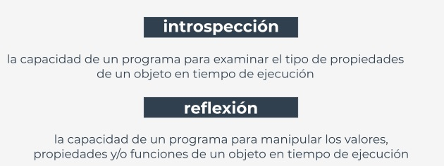

# ***PPO: Métodos***  
<br></br>  

## **Métodos a detalle**  
Resumamos todos los hechos relacionados con el uso de métodos en las clases de Python.  

Como ya sabes, un **método es una función que está dentro de una clase**.  

Existe un requisito fundamental: un **método esta obligado a tener al menos un parámetro** (no existen  
métodos sin parámetros; un método puede invocarse sin un argumento, pero no puede declararse sin  
parámetros).  

El primer (o único) parámetro generalmente se denomina ```self```. Te sugerimos que lo sigas nombrando  
de esta manera, darle otros nombres puede causar sorpresas inesperadas.  

El nombre *self* sugiere el propósito del parámetro: **identifica el objeto para el cual se invoca el método**.  

Si vas a invocar un método, no debes pasar el argumento para el parámetro ```self```, Python lo configurará por  
ti.  

El ejemplo en el editor muestra la diferencia.  
```
class Classy:
    def method(self):
        print("método")


obj = Classy()
obj.method()
```  

El código da como salida:  
```
método
```  

Toma en cuenta la forma en que hemos creado el objeto, hemos **tratado el nombre de la clase como una**  
**función**, y devuelve un objeto recién instanciado de la clase.  
#  
Si deseas que el método acepte parámetros distintos a ```self```, debes:  
- colocarlos después de ```self``` en la definición del método.  
- Pasarlos como argumentos durante la invocación sin especificar ```self```.  

Justo como aquí:  
```
class Classy:
    def method(self, par):
        print("método:", par)


obj = Classy()
obj.method(1)
obj.method(2)
obj.method(3)
```  

El código da como salida:  
```
método: 1
método: 2
método: 3
```  

<br></br>  


## **Métodos al detalle: continuación**  
El parámetro ```self``` es usado **para obtener acceso a la instancia del objeto y las variables de clase**.  

El ejemplo muestra ambas formas de utilizar el parámetro ```self```:  
```
class Classy:
    varia = 2
    def method(self):
        print(self.varia, self.var)


obj = Classy()
obj.var = 3
obj.method()
```  

El código da como salida:  
```
2 3
```  

El parámetro ```self``` también se usa **para invocar otros métodos desde dentro de la clase**.  

Justo como aquí:  
```
class Classy:
    def other(self):
        print("otro")

    def method(self):
        print("método")
        self.other()


obj = Classy()
obj.method()
```  

El código da como salida:  
```
método
otro
```  

<br></br>  


## **Métodos a detalle: continuación**  
Si se nombra un método de esta manera: ```__init__```, no será un método regular, será un **constructor**.  

Si una clase tiene un constructor, este se invoca automática e implícitamente cuando se instancia el objeto de la  
clase.  

El constructor:  
- Esta **obligado a tener el parámetro** ```self``` (se configura automáticamente)
- **Pudiera (pero no necesariamente) tener más parámetros** que solo ```self```; si esto sucede, la forma en  
que se usa el nombre de la clase para crear el objeto debe tener la definición ```__init__```.  
- **Se puede utilizar para configurar el objeto**, es decir, inicializa adecuadamente su estado intenro, crea  
variables de instancia, crea instancias de cualquier otro objeto si es necesario, etc.  

Observa el código en el editor. El ejemplo muestra un constructor muy simple pero funcional.  
```
class Classy:
    def __init__(self, value):
        self.var = value


obj_1 = Classy("objeto")

print(obj_1.var)
```

Ejecútalo. El código da como salida:  
```
objeto
```  

Ten en cuenta que el constructor:  
- **No puede retornar un valor**, ya que está diseñado para devolver un objeto recién creado y nada más.  
- **No se puede invocar directamente desde el objeto o desde dentro de la clase** (puedes invocar un  
constructor desde cualquiera de las superclases del objeto, pero discutiremos esto más adelante).  

<br></br>  


## **Métodos a detalle: continuación**  
Como ```__init__``` es un método, y un método es una función, puedes hacer los mismos trucos con  
constructores y métodos que con las funciones ordinarias.  

El ejemplo en el editor muestra cómo definir un constructor con un valor de argumento predeterminado.  
Pruebalo.  
```
class Classy:
    def __init__(self, value = None):
        self.var = value


obj_1 = Classy("objeto")
obj_2 = Classy()

print(obj_1.var)
print(obj_2.var)
```  

El código da como salida:  
```
objeto
None
```  

Todo lo que hemos dicho sobre **el manejo de los nombres** también se aplica a los nombres de métodos, un  
método cuyo nombre comienza con ```__``` está (parcialmente) oculto.  

El ejemplo muestra este efecto:  
```
class Classy:
    def visible(self):
        print("visible")
    
    def __hidden(self):
        print("oculto")


obj = Classy()
obj.visible()

try:
    obj.__hidden()
except:
    print("fallido")

obj._Classy__hidden()
```  

El código da como salida:  
```
visible
fallido
oculto
```  
Ejecuta el programa y pruébalo.  

<br></br>  


## **La vida interna de clases y objetos**  
Cada clase de Python y cada objeto de Python está pre-equipado con un conjunto de atributos útiles que pueden  
usarse para examinar sus capacidades.  

Ya conoces uno de estos: es la propiedad ```__dict__```.  

Observemos como esta propiedad trata con los métodos: mira el código en el editor.  
```
class Classy:
    varia = 1
    def __init__(self):
        self.var = 2

    def method(self):
        pass

    def __hidden(self):
        pass


obj = Classy()

print(obj.__dict__)
print(Classy.__dict__)
```  

Ejecútalo para ver que produce. Verifica el resultado.  

Encuentra todos los métodos y atributos definidos. Localiza el contexto en el que existen: dentro del objeto o  
dentro de la clase.  

<br></br>  


## **La vida interna de clases y objetos: continuación**  
```__dict__``` es un diccionario. Otra propiedad incorporada que vale la pena mencionar es una cadena llamada  
```__name__```.  

La propiedad contiene **el nombre de la clase**. No es nada emocionante, es solo una cadena.  

Nota: el atributo ```__name__``` está ausente del objeto, **existe dentro de las clases**.  

Si deseas **encontrar la clase de un objeto en particular**, puedes usar una función llamada ```type()```, la cual es  
capaz (entre otras cosas) de encontrar una clase que se haya utilizado para crear instancias de cualquier objeto.  

Observa el código en el editor, ejecútalo, y compruébalo tu mismo.  
```
class Classy:
    pass


print(Classy.__name__)
obj = Classy()
print(type(obj).__name__)
```  

La salida del código es:  
```
Classy
Classy
```  

Nota: algo como esto  
```
print(obj.__name__)
```  

Causará un error.  

<br></br>  


## **La vida interna de las clases y objetos: continuación**  
```__module__``` es una cadena, también **almacena el nombre del módulo que contiene la definición de la**  
**clase**.  

Vamos a comprobarlo: ejecuta el código en el editor.  
```
class Classy:
    pass


print(Classy.__module__)
obj = Classy()
print(obj.__module__)
```  

La salida del código es:  
```
__main__
__main__
```  

Como sabes, cualquier módulo llamado ```__main__``` en realidad no es un módulo, sino es el **archivo**  
**actualmente en ejecución**.  

<br></br>  


## **La vida interna de clases y objetos: continuación**  
```__bases__``` es una tupla. La **tupla contiene clases** (no nombres de clases) que son superclases directas de la  
clase.  

El orden es el mismo que el utilizado dentro de la definición de clase.  

Te mostraremos solo un ejemplo muy básico, ya que queremos resaltar **cómo funciona la herencia**.  

Además, te mostraremos cómo usar este atributo cuando discutamos los aspectos orientados a objetos de las  
excepciones.  

Nota: **solo las clases tienen este atributo**, los objetos no.  

Hemos definido una función llamada ```printBases()```, diseñada para presentar claramente el contenido de la  
tupla.  

Observa el código en el editor. Ejecútalo.  
```
class SuperOne:
    pass


class SuperTwo:
    pass


class Sub(SuperOne, SuperTwo):
    pass


def printBases(cls):
    print('( ', end='')

    for x in cls.__bases__:
        print(x.__name__, end=' ')
    print(')')


printBases(SuperOne)
printBases(SuperTwo)
printBases(Sub)
```  

Su salida es:  
```
( object )
( object )
( SuperOne SuperTwo )
```  

Nota: **una clase sin superclases explícitas apunta a object** (una clase de PYthon predefinida) como su  
antecesor directo.  

<br></br>  


## **Reflexión e introspección**  
Todo esto permite que el programador de PYthon realice dos actividades importantes específicas para muchos lenguajes objetivos. Las  
cuales son:  
- **Introspección**, que es la capacidad de un programa para examminar el tipo o las propiedades de un objeto en tiempo de  
ejecución.  
- **Reflexión**, que va un paso más allá, y es la capacidad de un programa para manipular los valores, propiedades y/o funciones de  
un objeto en tiempo de ejecución.  

<p align="center">

</p>  

En otras palabras, no tienes que conocer la definición completa de clase/objeto para manipular el objeto, ya que el objeto y/o su clase  
contienen los metadatos que te permiten reconocer sus características durante la ejecución del programa.  

<br></br>  


## **Investigando clases**  
Qué puedes descubrir acerca de las clases en Python? La respuesta es simple: todo.  

Tanto la reflexión como la instrospección permiten al programador hacer cualquier cosa con cada objeto, sin  
importar de dónde provenga.  

Analiza el código en el editor.  
```
1  |class MyClass:
2  |  pass
3  |
4  |
5  |obj = MyClass()
6  |obj.a = 1
7  |obj.b = 2
8  |obj.i = 3
9  |obj.ireal = 3.5
10 |obj.integer = 4
11 |obj.z = 5
12 |
13 |
14 |def incIntsI(obj):
15 |    for name in obj.__dict__.keys():
16 |        if name.startswith('i'):
17 |            val = getattr(obj, name)
18 |            if isinstance(val, int):
19 |                setattr(obj, name, val + 1)
20 |
21 |
22 |print(obj.__dict__)
23 |incIntsI(obj)
24 |print(obj.__dict__)
```

La función llamada ```incIntsI()``` toma un objeto de cualquier clase, escanea su contenido para encontrar  
todos los atributos enteros con nombres que comienzan con *i*, y los incrementa en uno.  

Imposible? de ninguna manera!  

Así es como funciona:  
- 

<br></br>
#  
[Ejercicios](/Modulo3/Seccion3/Sec3-ej.md)
<br></br>
[Soluciones](/Modulo3/Seccion3/Sec3-ejsol.md)  

#

[Volver a: Módulo 3 - Programación Orientada a Objetos y Procesamiento de Archivos en Python](../README.md)