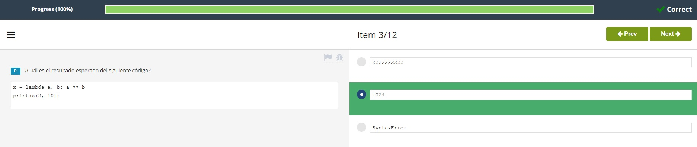

# **Soluciones Test Modulo 4**  

1. Cuál es el resultado esperado del siguiente código?  
<p align="center">

</p>  

<br></br>

2. Cuál es el resultado esperado del siguiente código?  
<p align="center">

</p>  

<br></br>

3. Cuál es el resultado esperado del siguiente código?  
<p align="center">

</p>  

<br></br>

4. Selecciona las sentencias **verdaderas** con respecto a la función ```map()```. (Selecciona **dos** respuestas)
<p align="center">

</p>  

<br></br>

5. Selecciona las sentencias **verdaderas** respecto a la función ```filter()```. (Selecciona **dos** respuestas)
<p align="center">

</p>  

<br></br>

6. Cuál es el resultado esperado del siguiente código?
<p align="center">

</p>  

<br></br>

7. Cuáles de las siguientes sentencias son **verdaderas**? (Selecciona **dos** respuestas)
<p align="center">

</p>  

<br></br>

8. Los dos modos básicos de apertura de archivos, mutuamente excluyentes, se denominan:
<p align="center">

</p>  

<br></br>

9. Un método capaz de leer datos de un archivo y pasarlos a un arreglo de bytes se denomina:
<p align="center">

</p>  

<br></br>

10. Qué sucede si se ejecuta el siguiente código, asumiendo que el directorio ```d``` ya existe?
<p align="center">

</p>  

<br></br>  

11. Qué sucede si se ejecuta el siguiente código?  
<p align="center">

</p>  

<br></br> 

12. Cuál es el resultado esperado del siguiente código?  
<p align="center">

</p>  

<br></br>

#
- [Volver al Test](TestM4.md)
#  
[Volver a: Módulo 4 - Miscelánea](../README.md)