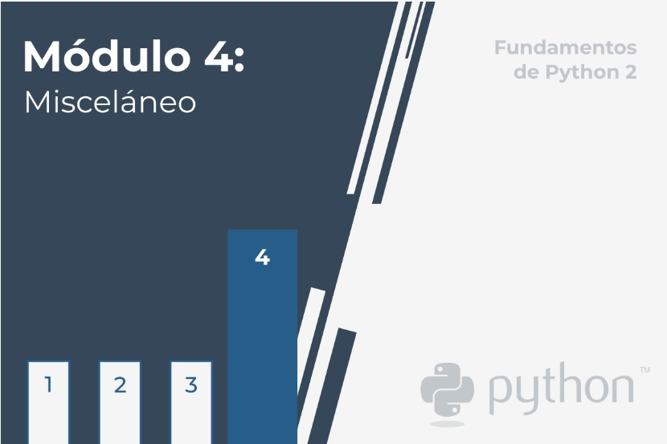

# **Fundamentos de Python 2: Módulo 4**   

  
    

## Módulo 4
**Misceláneo**

En este módulo, aprenderás sobre:  

- Generadores, iteradores y cierres.
- Cómo trabajar con un sistema de archivos, un árbol de directorios y archivos.  
- Módulos seleccionados de la biblioteca estándar de Python (*os*, *datetime*, *time*, y  
*calendar*)

  

#   

1. [Seccion 1 - Generadores y cierres](./Seccion1/_Seccion1.md)  
    - [Ejercicios](Seccion1/Sec1-ej.md)
  

2. [Seccion 2 - Procesando archivos](./Seccion2/_Seccion2.md)
    - [Ejercicios](Seccion2/Sec2-ej.md)
  

1. [Seccion 3 - Trabajando con archivos reales](./Seccion3/_Seccion3.md)
    - [Ejercicios](Seccion3/Sec3-ej.md)
  

1. [Seccion 4 - El módulo OS](./Seccion4/_Seccion4.md)  
    - [Ejercicios](Seccion4/Sec4-ej.md)
    - [Laboratorio 1](Seccion4/Sec4-Lab1.md)

  

1. [Seccion 5 - El módulo datetime](./Seccion5/_Seccion5.md)  
    - [Ejercicios](Seccion5/Sec5-ej.md)
  

1. [Seccion 6 - El módulo calendar](./Seccion6/_Seccion6.md)  
    - [Ejercicios](Seccion6/Sec6-ej.md)
  

#   

- [Test de ensayo](EjerciciosTestModulo4/TestM4.md)  
- [Test de ensayo (soluciones)](EjerciciosTestModulo4/soltest_mod4.md)

   

- [Examen Módulo 4](ExamenModulo4/ExamenM4.md)
- [Examen Módulo 4 (soluciones)](./ExamenModulo4/solex_mod4.md)

#  

    

- [PCAP2 Certified Associate in Python Programming: inicio](../README.md)