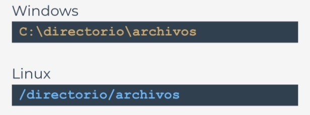

  

#  
[Ejercicios](/Modulo4/Seccion2/Sec2-ej.md)
  

[Soluciones](/Modulo4/Seccion2/Sec2-ejsol.md)  

#

[Volver a: Módulo 4 - Miscelaneo](../README.md)

# **Procesando archivos**  

    

## **Accediendo archivos desde código en Python**    
Uno de los problemas más comunes en el trabajo del desarrollador es **procesar datos almacenados en archivos** que generalmente  
se almacenan físicamente utilizando dispositivos de almacenamiento: discos duros, ópticos, de red o de estado sólido.  

Es fácil imaginar un programa que clasifique 20 números, y es igualmente fácil imaginar que el usuario de este programa ingrese estos  
veinte números directamente desde el teclado.  

Es mucho más difícil imaginar la misma tarea cuando hay 20,000 números para ordenar, y no existe un solo usuario que pueda  
ingresar estos números sin cometer un error.  

Es mucho más facil imaginar que estos números se almacenan en el archivo que lee el programa. El programa clasifica los números y  
no los envía a la pantalla, sino que crea un nuevo archivo y guarda la secuencia ordenada de números allí.  

Si queremos implementar una base de datos simple, la única forma de almacenar la información entre ejecuciones del programa es  
guardarla en un archivo (o archivos si tu base de datos es más compleja).  

Es un principio que cualquier problema de programación no simple se basa en el uso de archivos, ya sea que procese imágenes  
(almacenadas en archivos), multiplique matrices (almacenadas en archivos) o calcule salarios e impuestos (lectura de datos  
almacenados en archivos).  

  

Puedes preguntarte por que hemos esperado hasta ahora para mostrarte esto.  

La respuesta es muy simple: la forma en que Python accede y procesa los archivos se implementa utilizando un conjunto consistente  
de objetos. No hay mejor momento para hablar de esto.  

    

## **Nombres de archivos**  
Los diferentes sistemas operativos pueden tratar los archivos de diferentes maneras. Por ejemplo, Windows usa cona convención de  
nomenclatura diferente a la adoptada en los sistemas Unix/Linux.  

Si utilizamos la noción de un nombre de archivo canónico (un nombre que define de forma exclusiva la ubicación del archivo,  
independientemente de su nivel en el árbol de directorios), podemos darnos cuenta de que estos nombres se ven diferentes en  
Windows y en Unix/Linux:  

  