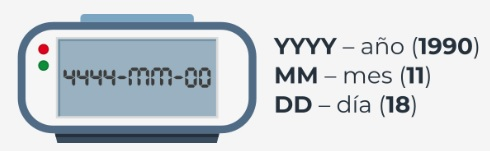

#  
[Ejercicios](/Modulo4/Seccion5/Sec5-ej.md)
<br></br>

[Soluciones](/Modulo4/Seccion5/Sec5-ejsol.md)  

#

[Volver a: Módulo 4 - Miscelaneo](../README.md)
# **El módulo *datetime***  

<br></br>  

## **Introducción al módulo *datetime***  
En esta sección, aprenderás sobre un módulo de Python llamado *datetime*.  

Como puedes adivinar, proporciona **clases para trabajar con la fecha y hora**. Si crees que no necesitas profundizar en este tema,  
hablemos de ejemplos del uso de la fecha y la hora en la programación.  

La fecha y la hora tienen innumerables usos y probablemente sea difícil encontrar una aplicación de producción que no os utilice.  
A continuación, se muestran algunos ejemplos:  

- **Registro de eventos**: gracias al conocimiento de la fecha y la hora, podemos determinar cuándo ocurre exactamente un error  
crítico en nuestra aplicación. Al crear registros, puedes especificar el formato de fecha y hora.  

- **Seguimiento de cambios en la base de datos**: a veces es necesario almacenar información sobre cuándo se creó o modificó un  
registro. El módulo *datetime* será perfecto para eso.  

- **Validación de datos**: pronto aprenderás a leer la fecha y hora actuales en Python. Conociendo la fecha y hora actuales, podrás  
validar varios tipos de datos, por ejemplo, si un cupón descuento ingresado por un usuario en nuestra aplicación sigue siendo  
válido.  

- **Almacenamiento de información importante**: te imaginas transferencias bancarias sin almacenar la finromación de  
cuándo se realizaron? La fecha y la hora de ciertas acciones deben conservarse y debemos ocuparnos de ello.  

<p align="center">

</p>  

La fecha y la hora se utilizan en casi todas las áreas de nuestras vidas, por lo que es importante familiarizarse con el módulo *datetime*  
de Python. Estás listo para una nueva dosis de conocimiento?  

<br></br>  


## **Obtener la fecha local actual y crear objetos del tipo fecha**  
Una de las clases proporcionadas por el módulo ```datetime``` es una clase llamada ```date```. Los objetos de esta  
clase representan una fecha que consta de año, mes y día. Mira el código en el editor para ver cómo se ve en la  
práctica y como obtener la fecha local actual usando el método ```today```.  
```python
from datetime import date

today = date.today()

print("Hoy:", today)
print("Año:", today.year)
print("Mes:", today.month)
print("Día:", today.day)
```  

Ejecuta el código para ver qué sucede.  

El método ```today``` devulve un objeto del tipo ```date``` que representa la fecha local actual. Toma en cuenta que  
el objeto ```date``` tiene tres atributos: *año*, *mes* y *día*.  

Ten cuidado, porque estos atributos son de solo lectura. Para crear un objeto ```date```, debes pasar los  
parámetros *año*, *mes* y *día* de la siguiente manera:  
```python
from datetime import date

my_date = date(2019, 11, 4)
print(my_date)
```  

Ejecuta el ejemplo para ver qué sucede.  
<br></br>

Al crear un objeto *date* toma en cuenta las siguientes restricciones:  

<table>
    <tr>
        <td height='50pt'><b>Parámetro</b></td>
        <td height='50pt', width='700pt'><b>Restricciones</b></td>
    </tr>
    <tr>
        <td><code>año</code></td>
        <td height='50pt', width='700pt'>El parámetro <i>año</i> debe ser mayor o igual a 1 (constante MINYEAR) y menor o igual a 9999 (constante MAXYEAR).</td>
    </tr>
    <tr>
        <td><code>mes</code></td>
        <td height='50pt', width='700pt'>El parámetro <i>mes</i> debe ser mayor o igual a 1 y menor o igual a 12.</td>
    </tr>
    <tr>
        <td><code>día</code></td>
        <td height='50pt', width='700pt'>El parámetro <i>día</i> debe ser mayor o igual a 1 y menor o igual que el último día del mes y año indicados.</td>
    </tr>
</table>  
<br></br>

**Nota**: más adelante en este curso, aprenderás a cambiar el formato de fecha predeterminado.  

<br></br>  


## **Creación de un objeto de fecha a partir de una marca de tiempo**  
La clase ```date``` nos da la capacidad de crear un objeto del tipo *fecha* a partir de una *marca de tiempo*.  

En Unix, la marca de tiempo expresa el número de segundos desde el 1 de Enero de 1970 a las 00:00:00 (UTC).  
Esta fecha se llama la **época Unix**, por que es cuando comenzó el conteo del tiempo en los sistemas Unix.  

La marca de tiempo es en realidad la diferencia entre una fecha en particular (incluida la hora) y el 1 de enero de  
1970, 00:00:00 (UTC), expresada en segundos.

Para crear un objeto de fecha a partir a partir de una marca de tiempo, debemos pasar una marca de tiempo Unix al  
método ```fromtimestamp```.  

Para este propósito, podemos usar el módulo ```time```, que proporciona funciones relacionadas con el tiempo.  
Uno de ellos es una función llamada ```time()```, que devuelve el número de segundos desde el 1 de enero de  
1970 hasta el momento actual en forma de número flotante. Echa un vistazo al ejemplo en el editor.  
```python
from datetime import date
import time

timestamp = time.time()
print("Marca de tiempo:", timestamp)

d = date.fromtimestamp(timestamp)
print("Fecha:", d)
```  

Ejecuta el código para ver el resultado.  

Si ejecutas el código de muestra varias veces, podrás ver cómo se incrementa la marca de tiempo. Vale la pena  
agregar que el resultado de la función ```time``` depende de la plataforma, porque **en los sistemas Unix y**  
**Windows, los segundos intercalares no se cuentan**.  

**Nota**: En esta parte del curso también hablaremos sobre el módulo *time*.  

<br></br>  


## **Creando un objeto de fecha usando el formato ISO**.  
El módulo ```datetime``` proporciona varios métodos para crear un objeto ```date```. Uno de ellos es el método  
```fromisoformat```, que toma una fecha en el formato **AAAA-MM-DD** compatible con el estándar ISO 8601.  

El estándar ISO 8601 define cómo se representan la fecha y la hora. Se usa a menudo, por lo que vale la pena  
tomarse un momento para familiarizarse con él. Echa un vistazo a la imagen que describe los valores requeridos  
por el formato:  

<p align="center">

</p>  

Ahora observa el código en el editor y ejecútalo.  
```python
from datetime import date

d = date.fromisoformat('2019-11-04')
print(d)
```
En nuestro ejemplo, AAAA es 2019, MM es 11 (noviembre) y DD es 04 (cuarto de noviembre).  

Cuando sustituyas la fecha, asegúrate de agregar 0 antes de un mes o de un día expresado por un número  
menor que 10.  

**Nota**: El método ```fromisoformat``` ha estado disponible en Python desde la versión 3.7.  

<br></br>  


## **El método *replace()***  
A veces, es posible que debas reemplazar el año, el mes o el día con un valor diferente. No puedes hacer esto  
con los atributos de año, mes y día por que son de solo lectura. En este caso, puedes utilizar el método llamado  
```replace```.  

Ejecuta el código en el editor:  
```python
from datetime import date

d = date(1991, 2, 5)
print(d)

d = d.replace(year=1992, month=1, day=16)
print(d)
```  

Resultado:  
```
1991-02-05
1992-01-16
```  

Los parámetros *year*, *month* y *day* son opcionales. Puedes pasar solo un parámetro al método ```replace```, por  
ejemplo, *año*, o los tres como en el ejemplo.  

El método ```replace``` devuelve un objeto ```date``` modificado, por lo que debes recordar asignarlo a alguna variable.  

<br></br>  


## **Que día de la semana es?**  
Uno de los métodos más útiles que facilita el trabajo con fechas es el método llamado ```weekday```. Devuelve el  
día de la semana como un número entero, donde 0 es el Lunes y 6 es el Domingo. Ejecuta el código en el editor.  
```python
from datetime import date

d = date(2019, 11, 4)
print(d.weekday())
```  

Resultado:  
```
0
```  

La clase ```date``` tiene un método similar llamado ```isoweekday```, que también devuelve el día de la semana  
como un número entero, pero 1 es Lunes y 7 es Domingo:  
```python
from datetime import date

d = date (2019, 11, 4)  
```  

Resultado:  
```
1
```  

Como puedes ver, para la misma fecha obtenemos un número entero diferente, pero expresando el mismo día  
de la semana. El entero devuelto por el método ```isodayweek``` sigue la especificación ISO 85601.  

<br></br>  


## **Creando objetos *time***  
Ya sabes cómo presentar una fecha utilizando el objeto ```date```. El módulo ```datetime``` también tiene una clase  
que te permite presentar la hora. Puedes adivinar su nombre? Sí, se llama ```time```:  

```
time(hour, minute, second, microsecond, tzinfo, fold )
```  

El constructor de la clase ```time``` acepta los siguientes parámetros opcionales:  
<table>
    <tr>
        <td height='50pt'><b>Parámetro</b></td>
        <td height='50pt', width='600pt'><b>Restricciones</b></td>
    </tr>
    <tr>
        <td><code>hour</code></td>
        <td height='50pt', width='600pt'>El parámetro <i>hour</i> debe ser mayor o igual que 0 y menor o igual que 23. </td>
    </tr>
    <tr>
        <td><code>minute</code></td>
        <td height='50pt', width='600pt'>El parámetro <i>minute</i> debe ser mayor o igual a 0 y menor o igual a 59.</td>
    </tr>
    <tr>
        <td><code>second</code></td>
        <td height='50pt', width='600pt'>El parámetro <i>second</i> debe ser mayor o igual a 0 y menor o igual que 59</td>
    </tr>
    <tr>
        <td><code>microsecond</code></td>
        <td height='50pt', width='600pt'>El parámetro <i>día</i> debe ser mayor o igual a 0 y menor que 1000000.</td>
    </tr>
    <tr>
        <td><code>tzinfo</code></td>
        <td height='50pt', width='600pt'>El parámetro <i>tzinfo</i> debe ser un objeto de la subclase <code>tzinfo</code> o <code>None</code> (por defecto)</td>
    </tr>
    <tr>
        <td><code>fold</code></td>
        <td height='50pt', width='600pt'>El parámetro <i>fold</i> debe ser 0 o 1 (predeterminadamente 0)</td>
    </tr>
</table>  

El parámetro *tzinfo* está asociado con las zonas horarias, mientras que *fold* está asociado con el tiempo de  
pared. No los usaremos durante este curso, pero te recomendamos que te familiarices con ellos.  

Veamos cómo crear un objeto de tiempo en la práctica. Ejecuta el código en el editor:  
```python
from datetime import time

t = time(14, 53, 20, 1)

print("Tiempo:", t)
print("Hora:", t.hour)
print("Minuto:", t.minute)
print("Segundo:", t.second)
print("Microsegundo:", t.microsecond)
```  

Resultado:  
```
Tiempo: 14:53:20.000001
Hora: 14
Minuto: 53
Segundo: 20
Microsegundo: 1
```  

En el ejemplo, pasamos cuatro parámetros al constructor de la clase: *hour*, *minute*, *second* y *microsecond*.  
Se puede acceder a cada uno de ellos utilizando los atributos de clase.  

**Nota**: Pronto te diremos cómo puedes cambiar el formato de hora predeterminado.  

<br></br>  


## **El módulo *time***  
Además de la clase ```time```, la biblioteca estándar de Python ofrece un módulo llamado ```time```, que proporciona  
una función relacionada con el tiempo. Ya se tuvo la oportunidad de aprender la función llamada ```time``` cuando  
se habló de la clase ```date```. Ahora veremos otra función útil disponible en este módulo.  

Debes pasar muchas horas frente a una computadora mientras realizas este curso. A veces, puedes sentir la  
necesidad de tomar una siesta. Por qué no? Escribamos un programa que simule la siesta corta de un  
estudiante. Echa un vistazo al código en el editor.  
```python
import time

class Student:
    def take_nap(self, seconds):
        print("Estoy muy cansado. Tengo que echarme una siesta. Hasta luego.")
        time.sleep(seconds)
        print("Dormí bien! Me siento genial!")

student = Student()
student.take_nap(5)
```  

Resultado:  
```
Estoy muy cansado. Tengo que echarme una siesta. Hasta luego.
Dormí bien! Me siento genial!
```  

La parte más importante del código de muestra es el uso de la función ```sleep``` (sí, puedes recordarla de una de  
las prácticas de laboratorio anteriores en el curso), que suspende la ejecución del programa por el determinado  
número de segundos.  

En nuestro ejemplo, son 5 segundos. Tienes razón, es una siesta muy corta.  

Extiende el sueño del estudiante cambiando la cantidad de segundos. Toma en cuenta que la función ```sleep```  
acepta solo un número entero o de punto flotante.  

<br></br>  


## **La función *ctime***  
El módulo ```time``` proporciona una función llamada ```ctime```, que **convierte el tiempo en segundos desde el 1**  
**de enero de 1970 (época Unix) en una cadena**.  

Recuerdas el resultado de la función ```time```? Eso es lo que necesitas pasar a ```ctime```. Echa un vistazo al  
ejemplo en el editor.  
```python
import time

timestamp = 1572879180
print(time.ctime(timestamp))
```  

La función ```ctime``` devuelve una cadena para la marca de tiempo pasada. En nuestro ejemplo, la marca de  
tiempo expresa el 4 de noviembre de 2019 a las 14:53:00.  

También es posible llamar a la función ```ctime``` sin especificar el tiempo en segundos. En este caso, se devolverá  
la hora actual:  
```python
import time
print(time.ctime())
```  

<br></br>  


## **Las funciones *gmtime()* y *localtime()***
Algunas de las funciones disponibles en el módulo ```time``` requieren conocimiento de la clase *struc_time*, pero  
antes de conocerlas, veamos cómo se ve la clase:  
```python
time.struct_time:
    tm_year   # Especifica el año.
    tm_mon    # Especifica el mes (valor de 1 a 12)
    tm_mday   # Especifica el día del mes (valor de 1 a 31)
    tm_hour   # Especifica la hora (valor de 0 a 23)
    tm_min    # Especifica el minuto (valor de 0 a 59)
    tm_sec    # Especifica el segundo (valor de 0 a 61)
    tm_wday   # Especifica el día de la semana (valor de 0 a 6)
    tm_yday   # Especifica el día del año (valor de 1 a 366)
    tm_isdst  # Especifica si se aplica el horario de verano (1: sí, 0: no, -1: no se sabe)
    tm_zone   # Especifica el nombre de la zona horaria (valor en forma abreviada)
    tm_gmtoff # Especifica el desplazamiento al este del UTC (valor en segundos)
```  

La clase *struct_time* también permite el acceso a valores usando índices. El índice ```0``` devuelve el valor en  
*tm_year*, mientras que ```8``` devuelve el valor en *tm_isdst*.  

Las excepciones son *tm_zone* y *tm_gmoff*, a las que no se puede acceder mediante índices. Veamos cómo usar  
la clase *struct_time* en la práctica. Ejecuta el código en el editor:  
```python
import time

timestamp = 1572879180
print(time.gmtime(timestamp))
print(time.localtime(timestamp))
```  

Resultado:  
```
time.struct_time(tm_year=2019, tm_mon=11, tm_mday=4, tm_hour=14, tm_min=53, tm_sec=0, tm_wday=0, tm_yday=308, tm_isdst=0)
time.struct_time(tm_year=2019, tm_mon=11, tm_mday=4, tm_hour=14, tm_min=53, tm_sec=0, tm_wday=0, tm_yday=308, tm_isdst=0)
```  

El ejemplo muestra dos funciones que convierten el tiempo transcurrido desde la época Unix al objeto  
*struct_time*. La diferencia entre ellos es que la función ```gmtime``` devuelve el objeto *struct_time* en UTC,  
mientras que la función ```localtime``` devuelve la hora local. Para la función ```gmtime```, el atributo *tm_isdst* es  
siempre 0.  

<br></br>  


## **Las funciones *asctime()* y *mktime()***
El módulo ```time``` tiene funciones que esperan un objeto *struct_time* o una tupla que almacena valores de  
acuerdo con los índices presentados cuando se habla de la clase *struct_time*. Ejecuta el ejemplo en el editor.  
```python
import time

timestamp = 1572879180
st = time.gmtime(timestamp)

print(time.asctime(st))
print(time.mktime((2019, 11, 4, 53, 0, 0, 308, 0)))
```  

Resultado:  
```
Mon Nov  4 14:53:00 2019
1572879180.0
```  

La primera de las funciones, llamada ```asctime```, convierte un objeto *struct_time* o una tupla en una cadena.  
Toma en cuenta que la conocida función ```gmtime``` se usa para obtener el objeto *struct_time*. Si no se  
proporciona un argumento a la función ```asctime```, se utilizará el tiempo devuelto por la función ```localtime```.  

La segunda función llamada ```mktime``` convierte un objeto *struct_time* o una tupla que expresa la hora local al  
número de segundos desde la época de Unix. En nuestro ejemplo, le pasamos una tupla, que consta de los  
siguientes valores.  


*2019 => tm_year*  
*11 => tm_mon*  
*4 => tm_mday*  
*14 => tm_hour*  
*53 => tm_min*  
*0 => tm_sec*  
*0 => tm_wday*  
*308 => tm_yday*  
*0 => tm_isdst*  

<br></br>  


## **Creación de objetos *datetime***  
En el módulo ```datetime```