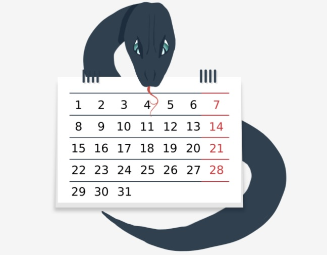
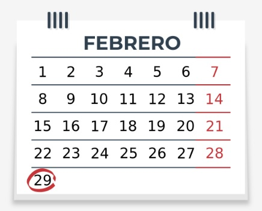
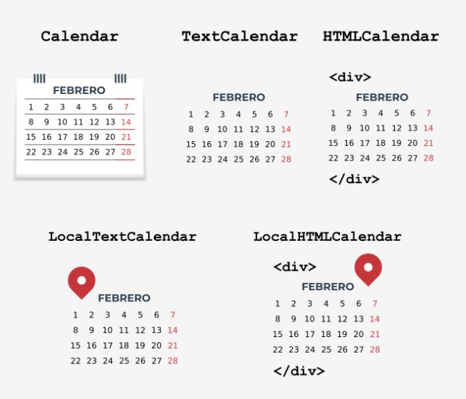

# **El módulo *calendar***  

<br></br>  

## **Introducción al módulo *calendar***  
Además de los módulos ```datetime``` y ```time```, la biblioteca estándar de Python proporciona un módulo llamado ```calendar``` que,  
como su nombre indica, ofrece **funciones relacionadas con el calendario*.  

Uno de ellos es, por supuesto, mostrar el calendario. Es importante que los días de la semana se muestren de Lunes a Domingo, y  
cada día de la semana tiene su representación en forma de número entero:  

<table>
    <tr>
        <td><b>Día de la semana</b></td>
        <td><b>Valor entero</b></td>
        <td><b>Constante</b></td>
    </tr>
    <tr>
        <td>Lunes</td>
        <td>0</td>
        <td><code>calendar.MONDAY</code></td>
    </tr>
    <tr>
        <td>Martes</td>
        <td>1</td>
        <td><code>calendar.TUESDAY</code></td>
    </tr>
    <tr>
        <td>Miérccoles</td>
        <td>2</td>
        <td><code>calendar.WEDNESDAY</code></td>
    </tr>
    <tr>
        <td>Jueves</td>
        <td>3</td>
        <td><code>calendar.THURSDAY</code></td>
    </tr>
    <tr>
        <td>Viernes</td>
        <td>4</td>
        <td><code>calendar.FRIDAY</code></td>
    </tr>
    <tr>
        <td>Sábado</td>
        <td>5</td>
        <td><code>calendar.SATURDAY</code></td>
    </tr>
    <tr>
        <td>Domingo</td>
        <td>6</td>
        <td><code>calendar.SUNDAY</code></td>
    </tr>
</table>  

La tabla de arriba muestra la representación de los días de la semana en el módulo ```calendar```. El primer día de la semana (Lunes)  
está representado por el valor *0* y la constante *calendar.MONDAY*, mientras que el último día de la semana (Domingo) está  
representado por el valor *6* y la constante *calendar.SUNDAY*.  

<p align="center">

</p>  

PAra los meses, los valores enteros se indexan a partir de 1, es decir, Enero se representa por 1 y diciembre por 12.  
Desafortunadamente, no hay constantes que expresen los meses.  

La información anterior te resultara útil cuando trabajes con el módulo ```calendar``` en esta parte del curso, pero primero  
comencemos con algunso ejemplos sencillos de calendario.  

<br></br>  


## **Tu primer calendario**  
Comenzarás tu aventura con el módulo ```calendar``` con una función simple llamada ```calendar```, que te permite  
**mostrar el calendario para todo el año**. Veamos cómo usarlo para mostrar el calendario de 2020. Ejecuta el  
código en el editor y observa qué sucede.  
```python
import calendar
print(calendar.calendar(2020))
```  

El resultado mostrado es similar al resultado del comando *cal* disponible en Unix. 
```
                                  2020

      January                   February                   March
Mo Tu We Th Fr Sa Su      Mo Tu We Th Fr Sa Su      Mo Tu We Th Fr Sa Su
       1  2  3  4  5                      1  2                         1
 6  7  8  9 10 11 12       3  4  5  6  7  8  9       2  3  4  5  6  7  8
13 14 15 16 17 18 19      10 11 12 13 14 15 16       9 10 11 12 13 14 15
20 21 22 23 24 25 26      17 18 19 20 21 22 23      16 17 18 19 20 21 22
27 28 29 30 31            24 25 26 27 28 29         23 24 25 26 27 28 29
                                                    30 31

       April                      May                       June
Mo Tu We Th Fr Sa Su      Mo Tu We Th Fr Sa Su      Mo Tu We Th Fr Sa Su
       1  2  3  4  5                   1  2  3       1  2  3  4  5  6  7
 6  7  8  9 10 11 12       4  5  6  7  8  9 10       8  9 10 11 12 13 14
13 14 15 16 17 18 19      11 12 13 14 15 16 17      15 16 17 18 19 20 21
20 21 22 23 24 25 26      18 19 20 21 22 23 24      22 23 24 25 26 27 28
27 28 29 30               25 26 27 28 29 30 31      29 30

        July                     August                  September
Mo Tu We Th Fr Sa Su      Mo Tu We Th Fr Sa Su      Mo Tu We Th Fr Sa Su
       1  2  3  4  5                      1  2          1  2  3  4  5  6
 6  7  8  9 10 11 12       3  4  5  6  7  8  9       7  8  9 10 11 12 13
13 14 15 16 17 18 19      10 11 12 13 14 15 16      14 15 16 17 18 19 20
20 21 22 23 24 25 26      17 18 19 20 21 22 23      21 22 23 24 25 26 27
27 28 29 30 31            24 25 26 27 28 29 30      28 29 30
                          31

      October                   November                  December
Mo Tu We Th Fr Sa Su      Mo Tu We Th Fr Sa Su      Mo Tu We Th Fr Sa Su
          1  2  3  4                         1          1  2  3  4  5  6
 5  6  7  8  9 10 11       2  3  4  5  6  7  8       7  8  9 10 11 12 13
12 13 14 15 16 17 18       9 10 11 12 13 14 15      14 15 16 17 18 19 20
19 20 21 22 23 24 25      16 17 18 19 20 21 22      21 22 23 24 25 26 27
26 27 28 29 30 31         23 24 25 26 27 28 29      28 29 30 31
                          30
```

Si deseas cambiar el formato  de calendario predeterminado, puedes utilizar los siguientes parámetros:  
- ```w```: ancho de la columna de fecha (por defecto 2)
- ```l```: número de líneas por semana (por defecto 1)
- ```c```: número de espacios entre las columnas del mes (por defecto 6)
- ```m```: número de columnas (por defecto 3)

La función de calendario requiere que se especifique el año, mientras que los otros parámetros responsables del  
formato son opcionales. Te recomendamos que pruebes estos parámetros tu mismo.  

Una buena alternativa a la función anterior es la función llamada *prcal*, que también toma los mismos  
parámetros que la función ```calendar```, pero no requiere el uso de la función ```print``` para mostrar el  
calendario. Su uso se ve así:  
```python
import calendar
calendar.prcal(2020)
```  

<br></br>  


## **Calendario para un mes específico**  
El módulo ```calendar``` tiene una función llamada ```month```, que permite mostrar un calendario para un mes  
específico. Su uso es realmente simple, solo necesita especificar el año y el mes, consulta el código en el editor:  
```python
import calendar
print(calendar.month(2020, 11))
```  

El ejemplo muestra el calendario de Noviembre de 2020.  
```
   November 2020
Mo Tu We Th Fr Sa Su
                   1
 2  3  4  5  6  7  8
 9 10 11 12 13 14 15
16 17 18 19 20 21 22
23 24 25 26 27 28 29
30
```  

Al igual que en la función ```calendar```, puedes cambiar el formato predeterminado con los siguientes parámetros:  
- ```w```: Ancho de la columna de fecha (por defecto 2)
- ```w```: número de liíneas por semana (por defecto 1)

**Nota**: También puedes utilizar la función ```prmonth```, que tiene los mismos parámetros que la función ```month```,  
pero no requiere el uso de la función ```print``` para mostrar el calendario.  

<br></br>  


## **La función *setfirstweekday()***  
Como ya sabes, por defecto en el módulo ```calendar```, el primer día de la semana es el Lunes. Sin embargo,  
puedes cambiar este comportamiento usando una función llamada ```setfirstweekday```.  

Recuerdas la tabla que muestra los días de la semana y su representación en forma de valores enteros? Es hora  
de usarla, porque el método ```setfirstweekday``` requiere un parámetro que exprese el día de la semana en  
forma de valor entero. Echa un vistazo al ejemplo en el editor:  
```python
import calendar

calendar.setfirstweekday(calendar.SUNDAY)
calendar.prmonth(2020, 12)
```  

El ejemplo usa la constante ```calendar.SUNDAY```, que contiene un valor de *6*. Por supuesto, puedes pasar este  
valor directamente a la función ```setfirstweekday```, pero la versión con una constante es más elegante.  

Como resultado, obtenemos un calendario que muestra el mes de Diciembre de 2020, en el que el primer día de  
todas las semanas es el Domingo.  
```
   December 2020
Su Mo Tu We Th Fr Sa
       1  2  3  4  5
 6  7  8  9 10 11 12
13 14 15 16 17 18 19
20 21 22 23 24 25 26
27 28 29 30 31
```  

<br></br>  


## **La función *weekday()***  
Otra función útil proporcionada por el módulo ```calendar``` es la función llamada ```weekday```, que devuelve el día  
de la semana como un valor entero para el año, mes y día. Veámoslo en la práctica.  

Ejecuta el código en el editor para verificar el día de la semana en que cae el 24 de Diciembre de 2020.  
```python
import calendar
print(calendar.weekday(2020, 12, 24))
```  

Resultado:  
```
3
```  

La función ```weekday``` devuelve el 3, lo que significa que el 24 de Diciembre de 2020 es Jueves.  

<br></br>  


## **La función *weekheader()***  
Probablemente hayas notado que el calendario contiene encabezados semanales en forma abreviada. Si es  
necesario, puedes obtener nombres cortos de días de la semana utilizando el método ```weekheader```.  

El método ```weekheader``` requiere que se especifique el ancho en caracteres para un día de la semana. Si el  
ancho que se proporciona es mayor que 3, aún obtendrás los nombres abreviados de los días de la semana que  
constan de tres caracteres.  

Entonces, veamos cómo obtener un encabezado más pequeño. Ejecuta el código en el editor.  
```python
import calendar
print(calendar.weekheader(2))
```  

Resultado:  
```
Mo Tu We Th Fr Sa Su
```  

**Nota**: Si cambias el primer día de la semana, por ejemplo, usando la función ```setfirstweekday```, afectará el  
resultado de la función ```weekheader```.  

<br></br>  


## **Cómo comprobamos si un año es bisiesto?**  
El módulo ```calendar``` proporciona dos funciones útiles para comprobar si los años son bisiestos.  

<p align="center">

</p>  

La primera, llamada ```isleap```, devuelve *True* si el año pasado es bisiesto, o *False* de lo contrario. El segundo,  
llamado ```leapdays```, devuelve el número de años bisiestos en el rango de años dado.  

Ejecuta el código en el editor:  
```python
import calendar

print(calendar.isleap(2020))
print(calendar.leapdays(2010, 2021))  # Hasta 2021, pero sin incluirlo.
```  

Resultado:  
```
True
3
```  

En el ejemplo, obtenemos el resultado 3, porque en el período de 2010 a 2020 solo hay tres años bisiestos  
(nota: 2021 no está incluido). Son los años 2012, 2016 y 2020.  

<br></br>  


## **Clases para crear calendarios**  
Las funciones que hemos mostrado hasta ahora no son todo lo que ofrece el módulo ```calendar```. Además de ellos, podemos utilizar  
las siguientes clases:  

- ```calendar.Calendar```: proporciona métodos para preparar datos de calendario y dar formato.
- ```calendar.TextCalendar```: Se utiliza para crear calendarios de texto regulares.
- ```calendar.HTMLCalendar```: se utiliza para crear calendarios HTML.
- ```calendar.LocalTextCalendar```: es una subclase de la clase ```calendar.TextCalendar```. El constructor de esta clase toma el  
parámetro *locale*, el cual se utiliza para devolver los nombres apropiados de los meses y días de la semana.
- ```calendar.LocalHTMLCalendar```: es una subclase de la clase ```calendar.HTMLCalendar```. El constructor de esta clase toma el  
parámetro "locale", que se usa para devolver los nombres apropiados de los meses y días de la semana.  

<p align="center">

</p>  

Durante este curso, ya tuviste la oportunidad de crear calendarios de texto al discutir las funciones del módulo ```calendar```.  

Es hora de probar algo nuevo. Echemos un vistazo más de cerca a los métodos de la clase ```calendar.```  

<br></br>  


## **Creación de un objeto *calendar***  
El constructor de la clase ```calendar``` toma un parámetro opcional llamado ```firstweekday```, por defecto es  
igual a 0 (lunes).  

El parámetro ```firstweekday```  debe ser un valor entero entre 0-6. Para este propósito, podemos usar las  
constantes ya conocidas. Mira el código en el editor:  
```python
import calendar  

c = calendar.Calendar(calendar.SUNDAY)

for weekday in c.iterweekdays():
    print(weekday, end=" ")
```  

El programa generará el siguiente resultado:  
```
6 0 1 2 3 4 5
```  

El ejemplo de código usa el método de la clase ```Calendar``` llamado ```iterwekdays```, que devuelve un iterador  
para los números de los días de la semana.  

El primer valor devuelto siempre es igual al valor de la propiedad ```firstweekday```. Debido a que en nuestro ejemplo el primer valor devuelto es 6, significa que la semana comienza un Domingo.  

<br></br>  


## **El método *itermonthdates()***  
La clase ```calendar``` tiene varios métodos que devuelven un iterador. Uno de ellos es el método  
```itermonthdates```, que requiere especificar el año y el mes.  

Como resultado, se devuelven todos los días del mes y año especificados, así como todos los días antes del  
comienzo del mes o del final del mes que son necesarios para obtener una semana completa.  

Cada día está representado por un objeto ```datetime.date```. Echa un vistazo al ejemplo en el editor.  
```python
import calendar  

c = calendar.Calendar()

for date in c.itermonthdates(2019, 11):
    print(date, end=" ")
```

El código muestra todos los días de Noviembre de 2019. Debido a que el primer día de Noviembre de 2019 fue  
Viernes, los siguientes días también se devuelven para obtener la semana completa: 28/10/19 (Lunes)  
29/10/2019 (Martes), 30/10/2019 (miércoles), 31/10/2019 (Jueves).  

El último día de Noviembre de 2019 fué Sábado, por lo que para mantener la semana completa, se devuelve un  
día más el 12/01/2019 (Viernes).  

<br></br>  


## **Otros métodos que devuelven iteradores**  
Otro método útil en la clase ```Calendar``` es el método llamado ```itermonthdates```, que toma año y mes como  
parámetros, y luego devuelve el iterador a los días de la semana representados por números.  

Mira el ejemplo en el editor.  
```python
import calendar  

c = calendar.Calendar()

for iter in c.itermonthdays(2019, 11):
    print(iter, end=" ")
```

Sin duda habrás notado la gran cantidad de ceros devueltos como resultado del código de ejemplo. Estos son  
días fuera del intervalo de meses especificado que se agregan para mantener la semana completa.  

Los primeros cuatro ceros representan el 28/10/2019 (Lunes) el 29/10/2019 (Martes) el 30/10/2019 (Miércoles) el  
31/10/2019 (Jueves). Los números restantes son días del mes, excepto el último valor de 0, que reemplaza la  
fecha 12/01/2019 (Domingo).  

Hay otros cuatro métodos similares en la clase ```Calendar``` que difieren en los datos devueltos:  
- ```itermonthdates2```: devuelve días en forma de tuplas que consisten en un número de día del mes y un  
número de día de la semana.  
- ```itermonthdates3```: devuelve días en forma de tuplas que constan de un año, un mes y un día de los  
números del mes. Este método ha estado disponible desde la versión 3.7 de Python.  
- ```itermonthdates4```: devuelve días en forma de tuplas que constan de números de año, mes, día del mes y  
día de la semana. Este método ha estado disponible desde la versión 3.7 de Python.  

Con fines de prueba, utiliza el ejemplo anterior y ve cómo se ven en la práctica los valores de retorno de los  
métodos descritos.  

<br></br>  


## **El método *monthdays2calendar()***  
La clase ```calendar``` tiene varios otros métodos útiles sobre los que puedes obtener más información en la  
documentación [https://docs.python.org/3/library/calendar.html](https://docs.python.org/3/library/calendar.html).  

Uno de ellos es el método ```monthdays2calendar```, que toma el año y el mes, y luego devuelve una lista de  
semanas en un mes específico. Cade semana es una tupla que consta de números de días y números de días de  
la semana. Mira el código en el editor.  
```python
import calendar  

c = calendar.Calendar()

for data in c.monthdays2calendar(2020, 12):
    print(data)
```  

Toma en cuenta que los números de los días fuera del mes están representados por 0, mientras que los  
números de los días de la semana son un número del 0 al 6, donde 0 es el Lunes y 6 es el Domingo.  

En un momento, este método puede resultar útil para completar una tarea de laboratorio. Estás listo?  
<br></br>  


## **Puntos Claves**  
1. En el módulo ```calendar```, los días de la semana se muestran de Lunes a Domingo. Cada día de la semana tiene su representación  
en forma de número entero, donde el primer día de la semana (Lunes) está representado por el valor 0, mientras que el último día de  
la semana (Domingo) está representado por el valor 6.  

<br></br>

2. Para mostrar un calendario de cualquier año, se emplea la función ```calendar``` con el año pasado como argumento, por ejemplo:  
```python
import calendar
print(calendar.calendar(2020))
```  
Nota: Una buena alternativa a la función anterior es la función llamada ```prcal```, que también toma los mismos parámetros que la  
función ```calendar```, pero no requiere el uso de la función ```print``` para mostrar el calendario.  

<br></br>

3. Para mostrar un calendario de cualquier mes del año, se emplea la función ```month```, pasándole el año y el mes. Por ejemplo:  
```python
import calendar
print(calendar.month(2020, 9))
```  
Nota: También puedes usar la función ```prmonth``` que tiene los mismos parámetros que la función ```month```, pero no requiere el uso  
de la función print para mostrar el calendario.  

<br></br>

4. La función ```setfirstdayweek``` te permite cambiar el primer día de la semana. Toma un valor de 0 a 6, donde 0 es Domingo y 6 es  
Sábado.  

<br></br>  

5. El resultado de la función ```weekday``` es un día de la semana como un valor entero para un año, mes y día determinados:  
```python
import calendar
print(calendar.weekday(2020, 9, 29)) # Esto muestra 1, que significa Martes.
```  

<br></br>  

6. La función ```weekheader``` devuelve los nombres de los días de la semana en forma abreviada. El método ```weekheader``` requiere  
que se especifique el ancho en caracteres para un día de la semana. Si el ancho que proporciona es mayor que 3, aún se obtendrán  
los nombres abreviados de los días de la semana que constan de solo tres caracteres. Por ejemplo:  
```python
import calendar
print(calendar.weekheader(2)) # Esto muestra: Mo Tu We Th Fr Sa Su
```  

<br></br>  


7. Una función muy útil disponible en el módulo ```calendar``` es una función llamada ```isleap```, que, como su nombre indica, te permite  
comprobar si el año es bisiesto o no:  
```python
import calendar
print(calendar.isleap(2020)) # Esto muestra: True
```  

<br></br>  


8. Puedes crear un objeto ```calendar``` tu mismo usando la clase ```Calendar```, que, al crear el objeto, te permite cambiar el primer día  
de la semana con el parámetro opcional ```firstweekday```, por ejemplo:  
```python
import calendar  

c = calendar.Calendar(2)

for weekday in c.iterweekdays():
    print(weekday, end=" ")
# Resultado: 2 3 4 5 6 0 1
```
```iterweekdays``` devuelve un iterador para los números de los días de la semana. El primer valor devuelto siempre es igual al valor  
de la propiedad ```firstweekday```.  

<br></br>  

#  
[Ejercicios](/Modulo4/Seccion6/Sec6-ej.md)
<br></br>

[Soluciones](/Modulo4/Seccion6/Sec6-ejsol.md)  

#

[Volver a: Módulo 4 - Miscelaneo](../README.md)