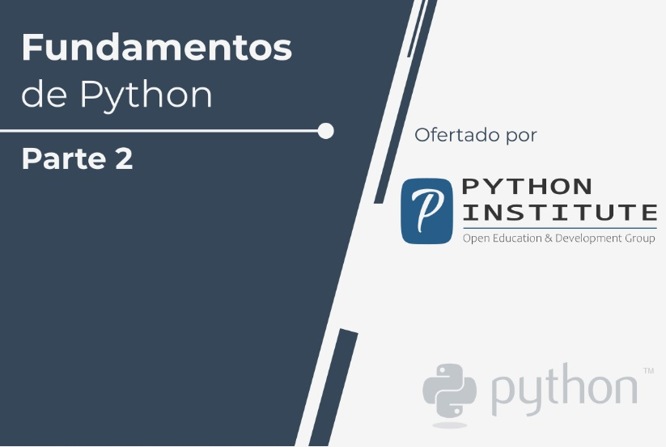

# Fundamentos de Python 2: INTERMEDIO  

  

#  

[Módulo 1 - Módulos, paquetes y PIP](./Modulo1/README.md)  

[Módulo 2 - Excepciones, Cadenas y Métodos de Listas](./Modulo2/README.md)  

[Módulo 3 - Programación Orientada a Objetos y Procesamiento de Archivos en Python](./Modulo3/README.md)  

[Módulo 4 - Misceláneo](./Modulo4/README.md)  

###

[Examen de selección]()

###  

## Temario del curso  

En este curso aprenderás:  

- Técnicas geerales de codificación.
- Emplear programación orientada a objetos en Python.
- Cómo importar y usar módulos de Python.  
- Cómo manejar las excepciones.  
- Cómo procesar arhivos.  

El curso se divide en 3 módulos:  

1. **Módulo 1**  
Módulos, paquetes y PIP.

2. **Módulo 2**  
Excepciones, Cadenas y Métodos de Listas  

3. **Módulo 3**  
Programación Orientada a Objetos y Procesamiento de Archivos en Python.  

## **Por qué debería aprender PYTHON?**  

Python es omnipresente y muchas personas usan numerosos dispositivos con tecnología de PYthon a diario, ya sea que se den cuenta  
o no. Ha habido millones (bueno, en realidad miles de millones) de líneas de código escritas en Python, lo que significa oportunidades  
casi ilimitadas para la reutilización de código y el aprendizaje de ejemplos bien elaborados. Además, existe una comunidad de Python 
grande y muy activa, siempre feliz de ayudar.

También hay un par de factores que hacen que Python sea excelente para el aprendizaje:

-Es fácil de aprender: el tiempo necesario para aprender Python es más corto que para muchos otros lenguajes; esto significa que 
es posible iniciar la programación real más rápido.
-Es fácil de usar para escribir software nuevo; a menudo es posible escribir código más rápido cuando se usa Python.
-Es fácil de obtener, instalar e implementar: Python es gratuito, abierto y multiplataforma; no todos los lenguajes pueden presumir de eso.  

Completar este curso puede ser un trampolín para aprender cualquier otro lenguaje de programación y para explorar tecnologías que 
usan a Python como base (por ejemplo, Django). Este curso se distingue por su asequibilidad, amigabilidad y apertura para el estudiante.

La primera parte comienza desde lo básico, guiándote paso a paso hacia los problemas complejos que se explican en la parte 2, 
convirtiéndote en un creador de software responsable capaz de asumir diferentes desafíos en muchas posiciones en la industria de TI.

# **¿Dónde se utiliza Python?**  

¿Te acuerdas de Battlefield 2, Battlefield 2142 y Battlefield Heroes? Son juegos de estrategia y disparos en primera persona de EA DICE.  
Todos estos juegos usan Python para la lógica y los controles del servidor. Python se usa con frecuencia para crear juegos gratuitos de  
código abierto, por ejemplo, OpenRTS, PySol, Metin 2 o Frets On Fire, juegos famosos tipo Guitar Hero fueron escritos en pygame.  

Y los principales sitios web y servicios como Dropbox, UBER, Spotify, Pinterest y BuzzFeed? Si. Todos fueron escritos, en mayor o menor  
medida, en Python. Otros ejemplos?  

- Aplicaciones de internet (BitTorrent, Jogger Publishing Assistant, The Circle, TwistedMatrix)  
- 3D CAD/CAM (FreeCAD, Fandango, Blender, Vintech RCAM)  
- Aplicaciones Empresarials (Odoo, Tryton, Picalo, LinOTP2, RESTx)  
- Aplicaciones de Imagen (Gnofract 4D, Gogh, ImgSeek, MayaVi, VPython)  
- Aplicaciones móviles (Aarlogic C05/3, AppBackup, Pyroute)  
- Aplicaciones de Oficina (Calibre, faces, notalon, pyspread)  
- Administradores de Información Personal (BitPim, Narval, Prioritise, Task Coach, WikidPad)  
(Fuente: [https://wiki.python.org/moin/PythonProjects](https://wiki.python.org/moin/PythonProjects))  

Generalmente, Python es una excelente opción para:

- Desarrollo Web (por ejemplo, los frameworks Django y Pyramid, micro-frameworks Flask y Bottle)  
- Computación científica y numérica (por ejemplo, SciPy, una colección de paquetes con fines matemáticos, científicos y de 
ingeniería; Ipython, un shell interactivo que permite la edición y grabación de sesiones de trabajo)  
- Educación (¡es un lenguaje brillante para enseñar programación! ¡Y es por eso que te ofrecemos este curso!)  
- GUIs de Escritorio (por ejemplo, wxWidgets, Kivy, Qt)  
- Desarrollo de software (control de compilación, gestión y pruebas: Scons, Buildbot, Apache Gump, Roundup, Trac)  
(Fuente:[https://www.python.org/about/apps/](https://www.python.org/about/apps/))  

Y muchos otros proyectos y herramientas de desarrollo.